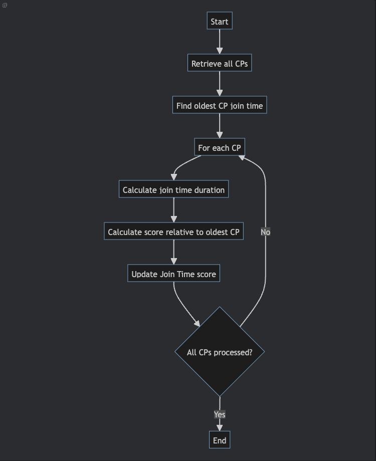
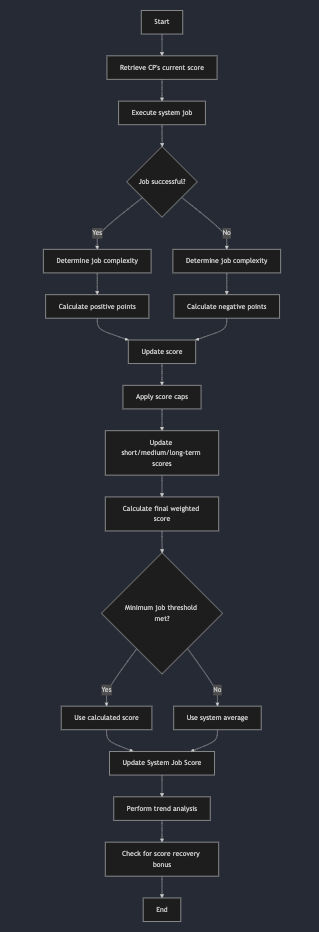
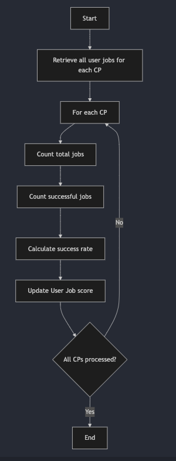
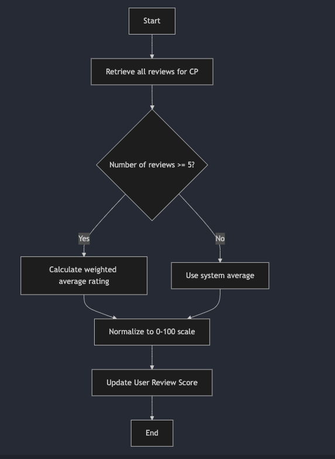
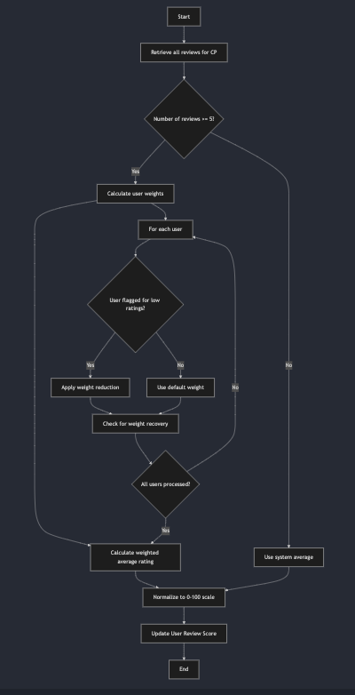

# Reputation System

**1. Overview**&#x20;

Swan Chain's reputation system is built on **AVS** (Actively Validated Services), which provides decentralized and verifiable data for evaluating the performance and reliability of CPs. The system combines **automated data analysis** and **user feedback** to assess providers across various metrics such as uptime, job completion rates, user claims, and system jobs. The integration of **AVS-based services** ensures the trustless execution of reputation scoring, using blockchain’s inherent properties of transparency, security, and immutability.

***

#### &#x20;**Key Components of the AVS-Based Reputation System**

The **AVS-based Computing Provider Reputation System** is composed of multiple layers, each responsible for evaluating different aspects of a CP’s performance:

**1.1 Sampling System (AVS-Based)**

The sampling system, powered by **AVSs**, selects random tasks from a verified pool of jobs (e.g., GPU, CPU, ZK jobs). These jobs are sent to CPs for execution, and the system tracks the results in real-time.

* **AVS Data Availability:** Data from these jobs is stored on decentralized data availability layers, ensuring that all performance metrics are verifiable and tamper-proof.
* **Distribution System:** The system distributes tasks to CPs, and AVS ensures transparency by maintaining records of job assignments and completions.

**2.1 Probe System (AVS Monitoring)**

The **Probe System** regularly checks the performance of CPs using AVS-based tools. Every few seconds, the system validates the completion and accuracy of tasks performed by the providers.

* **AVS Validation:** Probes ensure that results are validated on-chain, utilizing AVS capabilities for data verification. The system ensures no tampering or manipulation of job results.

**2.2 Job Settlement System (AVS-Backed Payments)**

Once tasks are completed, the job settlement system determines whether CPs should be paid based on AVS-verified job outcomes.

* **AVS for Automatic Payments:** Payments are made automatically via smart contracts on the Swan Chain network. The reputation score of a CP directly influences the settlement process, and incomplete jobs lead to collateral slashing.

### 2. Components and Scoring

The total reputation score is composed of the following components:

#### Current Version Composition:

| Component                 | Weight | Description                                        |
| ------------------------- | ------ | -------------------------------------------------- |
| Machine Uptime            | 10%    | Availability of the CP based on continuous pinging |
| Join Time                 | 10%    | Longevity of the CP in the system                  |
| System Job Score          | 35%    | Performance on controlled, system-initiated jobs   |
| User Job Score            | 15%    | Success rate of user-initiated jobs                |
| User Request Refund Score | 30%    | Impact of confirmed user claims on jobs            |

#### Rationale for Component Selection and Weighting

The reputation scoring system comprises six key components, each chosen for its unique contribution to assessing Compute Provider (CP) performance. The weighting of each component reflects its relative importance in the overall evaluation.

1. Machine Uptime (10%):
   * Measures basic reliability
   * Critical but not the sole indicator of performance
   * Low weight as it's a minimum expectation
2. Join Time (10%):
   * Reflects CP experience and commitment
   * Balances new entrants vs. established CPs
   * Low weight to avoid overly penalizing new, high-performing CPs
3. User Review Score (10%):
   * Captures user satisfaction
   * Provides qualitative performance insights
   * Lower weight due to potential subjectivity
4. User Claim Score (25%):
   * Indicates serious issues affecting users
   * High weight due to direct impact on service quality
   * Balances user feedback with objective measures
5. System Job Score (30%):
   * Offers controlled, objective performance measurement
   * Highest weight due to standardized evaluation across all CPs
   * Reflects core CP capabilities
6. User Job Score (15%):
   * Measures real-world performance
   * Complements system jobs with diverse, practical scenarios
   * Moderate weight balances importance with potential variability

This balanced approach ensures a comprehensive evaluation of CP performance, considering both objective metrics and user experiences. The weightings prioritize factors directly impacting service quality and reliability, while still accounting for longevity and user satisfaction.

#### 2.1 Scoring Strategies

**Machine Uptime (100 points max)**

* Score = Availability percentage (e.g., 99.9% uptime = 99.9 points)

**Join Time (100 points max)**

* Score = (CP's join time / Oldest CP's join time) \* 100

**System Job Score (100 points max)**

* Initial score: 50
* For each successful job: +10 points
* For each failed job: -20 points
* Score is capped at 100 points and cannot go below 0

**User Request Refund Score (100 points max)**

* Score = \[(Successfully completed jobs - Approved refund jobs) / Successfully completed jobs] \* 100

**User Job Score (100 points max)**

* Score = (Successfully completed jobs / Total number of jobs) \* 100

#### 2.2 Total Reputation Score Calculation

The total reputation score is calculated as follows:

Total Score = SUM(contribution percentage \* score of the category component)

**Example Calculations**

1.  Example CP with average performance:

    * Machine Uptime: 99.5 points
    * Join Time: 70 points (joined 70% as long ago as the oldest CP)
    * System Job Score: 80 points
    * User Job Score: 95 points

    Total Score = (99.5 \* 0.10) + (70 \* 0.20) + (80 \* 0.50) + (95 \* 0.20) = 82.95
2.  Example CP with excellent performance:

    * Machine Uptime: 99.9 points
    * Join Time: 100 points (oldest CP)
    * System Job Score: 100 points
    * User Job Score: 99 points

    Total Score = (99.9 \* 0.10) + (100 \* 0.20) + (100 \* 0.50) + (99 \* 0.20) = 99.79
3.  Example CP with poor performance:

    * Machine Uptime: 95 points
    * Join Time: 30 points (relatively new CP)
    * System Job Score: 60 points
    * User Job Score: 80 points

    Total Score = (95 \* 0.10) + (30 \* 0.20) + (60 \* 0.50) + (80 \* 0.20) = 61.5

### 3. Application of Reputation Scores in Bidder Selection

The total reputation score is used to select bidders for jobs in a way that balances fairness with performance incentives. Here's how the process works:

#### 3.1 Bidder Selection Process

1. Collect Reputation Scores: Gather the reputation scores of all bidders for a job.
2. Normalize Scores: Convert the scores into probabilities by dividing each score by the sum of all scores.
3. Create Cumulative Distribution: Form a cumulative distribution from these probabilities.
4. Random Selection: Generate a random number and use it to select a bidder based on the cumulative distribution.

This method gives bidders with higher reputation scores a greater chance of being selected, while still allowing lower-scored bidders an opportunity to win bids.

#### 3.2 Example

Let's say we have four bidders with the following reputation scores:

* Bidder A: 85
* Bidder B: 92
* Bidder C: 78
* Bidder D: 88

Step 1: Collect Reputation Scores \[85, 92, 78, 88]

Step 2: Normalize Scores Total sum = 85 + 92 + 78 + 88 = 343 Probabilities:

* A: 85/343 ≈ 0.2478
* B: 92/343 ≈ 0.2682
* C: 78/343 ≈ 0.2274
* D: 88/343 ≈ 0.2566

Step 3: Create Cumulative Distribution

* A: 0.2478
* B: 0.2478 + 0.2682 = 0.5160
* C: 0.5160 + 0.2274 = 0.7434
* D: 0.7434 + 0.2566 = 1.0000

Step 4: Random Selection If the random number generated is 0.6, we would select Bidder C, as 0.6 falls between 0.5160 and 0.7434 in the cumulative distribution.

#### 3.3 Advantages of This Approach

1. Performance Incentive: Higher-rated bidders have a better chance of being selected, encouraging CPs to maintain good performance.
2. Fairness: Lower-rated bidders still have a chance to win bids, allowing for potential improvement and preventing monopolization by top-rated CPs.
3. Randomization: The element of randomness helps distribute jobs across a range of CPs, promoting system resilience and diversity.

This selection method ensures that reputation scores have a meaningful impact on job distribution while maintaining a dynamic and fair marketplace for all Compute Providers.

### 4. Monitoring and Reporting

* Implement a Grafana dashboard to show the trend of the total score and all component scores
* The dashboard will display historical data and allow for trend analysis of CP performance over time

### 5. Implementation Details

#### 5.1 Machine Uptime Monitoring

* Implement a continuous pinging system to monitor CP availability
* Update uptime scores in real-time or at regular intervals (e.g., hourly)

#### 5.2 Join Time Tracking

* Store the initial join timestamp for each CP
* Update join time scores daily, considering the current oldest CP as the benchmark

Flow Chart:

<figure><figcaption></figcaption></figure>

#### 5.3 System Job Score Design

The System Job Score is a critical component of the CP reputation system, designed to evaluate CP performance based on controlled, system-initiated jobs. This score provides an objective measure of CP reliability and capability.

**5.3.1 Scoring Mechanism**

* The score ranges from 0 to 100 points.
* Each CP starts with an initial score of 50 points.
* Points are added for successful jobs and deducted for failed jobs.
* The score is updated after each system job completion.

**5.3.2 Job Outcome Scoring**

1. Successful Job: +10 points
2. Failed Job: -20 points

**5.3.3 Score Calculation**

After each job:

```
New Score = Previous Score + Points from job outcome
```

The score is capped at a minimum of 0 and a maximum of 100 points.

**5.3.4 Time-based Performance Evaluation**

Implement a time-based evaluation to give more weight to recent performance:

1. Calculate a short-term score (last 7 days).
2. Calculate a medium-term score (last 30 days).
3. Calculate a long-term score (all-time).

The final System Job Score is a weighted average of these three scores:

```
Final Score = (Short-term * 0.5) + (Medium-term * 0.3) + (Long-term * 0.2)
```

**5.3.5 Minimum Job Threshold**

* Require a minimum of 10 completed system jobs before including this score in the total reputation calculation.
* For CPs with fewer than 10 jobs, use the system average for this component.

**5.3.6 Performance Trend Analysis**

Implement a trend analysis to identify improving or declining performance:

1. Calculate the rate of change in score over the last 30 days.
2. Categorize CPs as "Improving," "Stable," or "Declining" based on this trend.
3. Use this information for internal monitoring and potentially for CP feedback.

**5.3.7 Job Distribution and Fairness**

To ensure fair evaluation:

1. Distribute an equal number of jobs to all CPs daily.
2. Ensure a mix of basic, complex, and critical jobs for each CP over time.
3. Randomize job assignment to prevent gaming of the system.

**5.3.8 Score Recovery Mechanism**

Implement a gradual score recovery to allow CPs to improve their standing:

* If a CP maintains a 100% success rate for 7 consecutive days, add a bonus of 5 points to their score (up to the maximum of 100).

**5.3.9 Updated Flow Chart**

<figure><figcaption></figcaption></figure>

**5.3.10 Integration with Total Reputation Score**

The System Job Score contributes 30% to the total reputation score in the future version composition, as previously defined.

**5.3.11 Example Calculation**

Let's consider a CP with the following recent performance:

* Short-term score (7 days): 85 points
* Medium-term score (30 days): 75 points
* Long-term score (all-time): 70 points

Final System Job Score = (85 \* 0.5) + (75 \* 0.3) + (70 \* 0.2) = 42.5 + 22.5 + 14 = 79 points

This score would then contribute to 30% of the CP's total reputation score.

#### 5.4 User Job Tracking

* Implement a system to track all user-initiated jobs and their outcomes
* Update user job scores daily based on the latest success rates

Flow Chart:

<figure><figcaption></figcaption></figure>

## Future Works

### 1. User Review Score Design

The User Review Score aims to incorporate user feedback on completed jobs, providing a measure of user satisfaction with the Compute Provider's (CP) service.

#### 1.1 Scoring Mechanism

* Users can rate completed jobs on a scale of 1 to 5 stars.
* Each rating contributes to a rolling average of the CP's performance.
* The score is normalized to a 0-100 scale.

#### 1.2 Calculation

1.  Calculate the average rating:

    ```
    Average Rating = Sum of all ratings / Number of ratings
    ```
2.  Normalize to 0-100 scale:

    ```
    User Review Score = (Average Rating / 5) * 100
    ```

#### 1.3 Weighting and Decay

* More recent reviews have a higher weight to reflect current performance.
* Implement a time decay factor: reviews older than 30 days have 50% weight, older than 90 days have 25% weight.

#### 1.4 Minimum Reviews Threshold

* Require a minimum of 5 reviews before including this score in the total reputation calculation.
* For CPs with fewer than 5 reviews, use the system average for this component.

Flow Chart:

<figure><figcaption></figcaption></figure>

#### 1.5 User Weighting System

To address the issue of users who consistently provide the lowest job reviews, we'll implement a user weighting system:

1. Track each user's review history.
2. Identify users who consistently give the lowest ratings.
3. Gradually reduce the weight of their reviews in the overall score calculation.

**1.5.1 Consistent Low Rating Identification**

* Define "lowest rating" as 1 star out of 5.
* Track the percentage of 1-star ratings for each user.
* If a user's percentage of 1-star ratings exceeds a threshold (e.g., 80%) over a significant number of reviews (e.g., 10+), flag them for weight reduction.

**1.5.2 Weight Reduction Mechanism**

* Start all users with a weight of 1.0 (100% influence).
*   For flagged users, reduce their weight using the following formula:

    ```
    User Weight = max(0.2, 1 - (Percentage of 1-star ratings - Threshold))
    ```

    This ensures their weight never goes below 0.2 (20% influence).

**1.5.3 Weight Recovery**

* If a flagged user starts providing more balanced ratings, gradually increase their weight.
* For every 5 consecutive ratings that are not 1-star, increase their weight by 0.1, up to a maximum of 1.0.

**1.5.4 Integration into Score Calculation**

When calculating the average rating for a CP, use the weighted average:

```
Weighted Average Rating = Sum(Rating * User Weight) / Sum(User Weights)
```

Then proceed with the normalization to the 0-100 scale as before.

#### 1.6 Updated Flow Chart

<figure><figcaption></figcaption></figure>

This full user review design addresses the concern about users who consistently give the lowest job reviews. By implementing this weighting system, we ensure that while all feedback is considered, the impact of potentially unfair or overly critical reviews is mitigated. This approach maintains the value of user feedback while protecting Compute Providers from undue negative impact from a small number of extremely critical users.

### 2. User Request Review Score Design

The User Request Review Score reflects the reliability of the CP based on valid claims made by users for issues with completed jobs.

#### 2.1 Scoring Mechanism

* Start with a perfect score of 100.
* Score based on ratio of number of Request Review to number of completions.
* As more tasks are completed, the score will increase

#### 2.2 Calculation

1.  For each new claim:

    ```
     Score = [(Successfully completed jobs - Approved refund jobs) / Successfully completed jobs] * 100
    ```

#### 2.3 Request Review Verification Process

* Implement a claim review process to verify the validity of user claims before applying score deductions.
* Manual review for each case.
*

### 3. Integration with Total Reputation Score

#### 3.1 Updated Future Version Composition

| Component         | Weight | Description                                        |
| ----------------- | ------ | -------------------------------------------------- |
| Machine Uptime    | 10%    | Availability of the CP based on continuous pinging |
| Join Time         | 10%    | Longevity of the CP in the system                  |
| User Review Score | 10%    | Feedback provided by users on finished jobs        |
| User Claim Score  | 25%    | Impact of confirmed user claims on jobs            |
| System Job Score  | 30%    | Performance on controlled, system-initiated jobs   |
| User Job Score    | 15%    | Success rate of user-initiated jobs                |

#### 3.2 Updated Total Score Calculation

The total reputation score calculation remains the same, but now includes the new components:

```
Total Score = (Machine Uptime * 0.10) + (Join Time * 0.10) + (User Review Score * 0.10) + 
              (User Claim Score * 0.25) + (System Job Score * 0.30) + (User Job Score * 0.15)
```

#### 3.3 Example Calculation with New Components

Let's consider a CP with the following scores:

* Machine Uptime: 99.5 points
* Join Time: 80 points
* User Review Score: 90 points
* User Claim Score: 95 points
* System Job Score: 85 points
* User Job Score: 92 points

Total Score = (99.5 \* 0.10) + (80 \* 0.10) + (90 \* 0.10) + (95 \* 0.25) + (85 \* 0.30) + (92 \* 0.15) = 9.95 + 8 + 9 + 23.75 + 25.5 + 13.8 = 90 points

This CP would be considered to have excellent overall performance.
