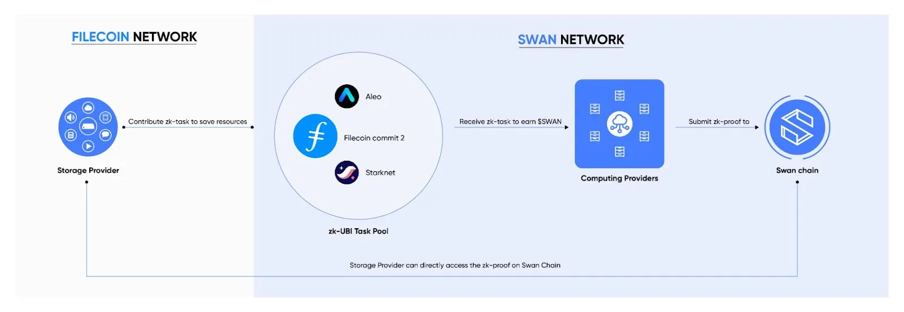

# ZK Pool

Swan’s ZK mechanism integrates various ZK-proof computations over time, such as Filecoin commit2, Aleo, StarkNet, Scroll, etc.

The ZK Task Pool serves as a centralized hub for various ZK workloads for CPs:

<figure><figcaption></figcaption></figure>

* Storage Providers can contribute their ZK-proof work to enrich the pool of tasks
* Computing Providers can receive tasks from the ZK task pool
* CPs generate proofs recorded on Swan Chain, allowing Storage providers to directly access the proofs they need.

By deeply integrating Filecoin’s intensive workloads and establishing an open task pool, Swan’s ZK tasks brings about mutually reinforcing network collaborations.

## Filecoin Commit 2 (C2) with ZK

[Commit 2](https://docs.filecoin.io/storage-providers/architecture/sealing-pipeline#commit-2) (C2) is an intensive computational step in Filecoin's sector sealing pipeline requiring the generation of a [zk-SNARK](https://docs.filecoin.io/reference/general/glossary#zero-knowledge-succinct-non-interactive-argument-of-knowledge-zk-snark) proof to validate storage commitment.

Swan's ZK mechanism incorporates such heavy workloads into an incentive design that allows [Computing Provider](../../../bulders/computing-provider/fog-computing-provider-fcp/computing-provider-setup.md) within the Swan ecosystem to accelerate proofs while earning ZK rewards.

**Key Points about C2**

* C2 involves creating a zk-SNARK proof to validate the miner’s commitment to store sector data.
* It is a GPU-intensive computation, requiring significant compute resources (peak memory of 275GiB for 32GiB sectors).

**Receiving ZK-Tasks**

Computing providers on Swan can follow [this guide ](../../../bulders/computing-provider/edge-computing-provider-ecp/ecp-setup.md)to configure themselves to receive and process outsourced Filecoin C2 sector sealing tasks.

Once set up, suitable C2 tasks get automatically assigned based on provider declared capacity.

**Contributing ZK-proof Workloads**

For Storage Providers interested in contributing tasks to this pool, please refer to this guide: [contribute-zk-ubi-task](../../../bulders/market-provider/web3-zk-computing-market/contribute-zk-ubi-task/ "mention")

But if you have an independent zero-knowledge proof system that requires robust computational support from the Swan Network, you can directly apply for our DevGrant [here](https://github.com/swanchain/devgrants/issues/new/choose).\
