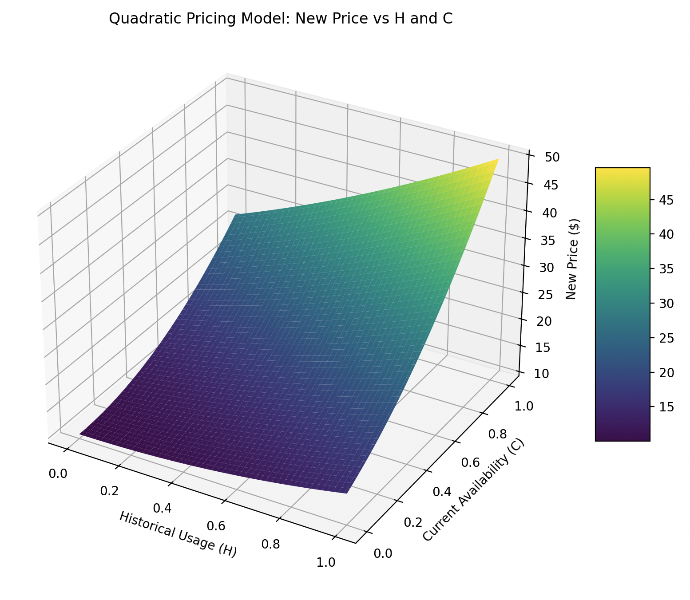

# Dynamic Pricing Strategy for Computing Resources: Quadratic Demand Model

## 1. Introduction

In the fast-paced world of cloud computing and AI, the demand for GPU resources fluctuates rapidly. Our new dynamic pricing strategy aims to optimize resource allocation by implementing a quadratic demand model. This approach ensures that prices respond more aggressively to high demand, promoting efficient resource utilization and improved accessibility for all users.

## 2. Why a Quadratic Demand Model?

### Advantages of Quadratic Pricing:
- More responsive to high-demand situations
- Encourages efficient resource usage during peak times
- Provides better price signals to users about resource scarcity
- Allows for more nuanced pricing across different demand levels

## 3. Quadratic Dynamic Pricing Model

Our new model uses a quadratic equation to calculate the demand factor, which is then used to adjust the base price of resources in real-time.

### Core Formula:

```
New Price = Demand Factor * Base Price
```

Where:
- Base Price: The standard price set for the resource
- Demand Factor: A multiplier based on current demand (range: 1.0 to 5.0)

### Demand Factor Calculation:

The demand factor is now calculated using a quadratic function:

```
Demand Factor = 1 + 4 * (w1 * H + w2 * C)^2
```

Where:
- H: Historical usage factor (0 to 1)
- C: Current resource availability factor (0 to 1)
- w1 = 0.35 (weight for historical usage)
- w2 = 0.65 (weight for current availability)

This quadratic formula ensures that the demand factor grows more rapidly as demand increases, with a maximum value of 5.0.

## 4. Components of the Demand Factor

### 4.1 Historical Resource Usage (H)

We analyze the past 30 days of usage data, focusing on patterns in daily and weekly usage.

Calculation:
```
H = (Current Hour Avg Usage - Overall Avg Usage) / (Max Usage - Overall Avg Usage)
```

### 4.2 Current Resource Availability (C)

This factor considers the current occupation rate of resources, but only starts contributing when more than 40% of resources are occupied.

Calculation:
```
If (Occupied Resources / Total Resources) <= 0.4:
    C = 0
Else:
    C = ((Occupied Resources / Total Resources) - 0.4) / 0.6
```

## 5. Price Model


## 6. Example Scenarios

### Scenario 1: Low Demand
- Historical Usage: Low (H = 0.2)
- Current Availability: 45% resources occupied (C = 0.083)

Weighted Sum = 0.35 * 0.2 + 0.65 * 0.083 = 0.124
Demand Factor = 1 + 4 * (0.124)^2 = 1.061
For a base price of $10/hour: New Price = 1.061 * $10 = $10.61/hour

### Scenario 2: Moderate Demand
- Historical Usage: Average (H = 0.5)
- Current Availability: 70% resources occupied (C = 0.5)

Weighted Sum = 0.35 * 0.5 + 0.65 * 0.5 = 0.5
Demand Factor = 1 + 4 * (0.5)^2 = 2.0
For a base price of $10/hour: New Price = 2.0 * $10 = $20/hour

### Scenario 3: High Demand
- Historical Usage: High (H = 0.8)
- Current Availability: 90% resources occupied (C = 0.833)

Weighted Sum = 0.35 * 0.8 + 0.65 * 0.833 = 0.821
Demand Factor = 1 + 4 * (0.821)^2 = 3.697
For a base price of $10/hour: New Price = 3.697 * $10 = $36.97/hour

### Scenario 4: Peak Demand
- Historical Usage: Very High (H = 1.0)
- Current Availability: 100% resources occupied (C = 1.0)

Weighted Sum = 0.35 * 1.0 + 0.65 * 1.0 = 1.0
Demand Factor = 1 + 4 * (1.0)^2 = 5.0
For a base price of $10/hour: New Price = 5.0 * $10 = $50/hour

## 7. Conclusion

Our quadratic dynamic pricing strategy represents a significant advancement in resource allocation efficiency. By implementing a model that responds more aggressively to high demand, we ensure that our pricing accurately reflects the real-time value of our computing resources. This approach not only optimizes resource utilization but also provides clearer price signals to our users, allowing them to make more informed decisions about their resource usage.

As we roll out this new pricing model, we remain committed to transparency and fairness. Our goal is to create a balanced ecosystem where all users have access to the resources they need, when they need them. We will continually monitor and refine this system to ensure it meets the evolving needs of our diverse user base and maintains our position at the forefront of cloud computing technology.