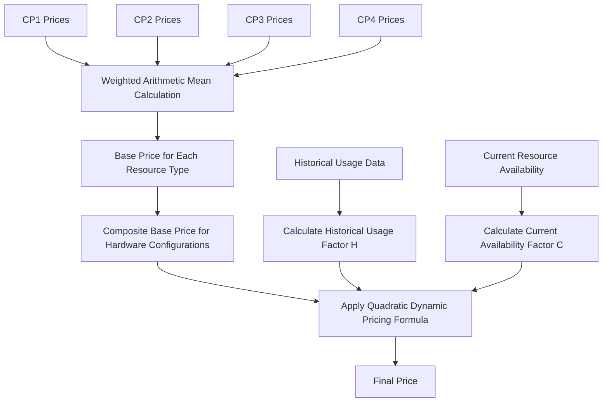

```mermaid
graph TD
    A[CP1 Prices] --> E[Weighted Arithmetic Mean Calculation]
    B[CP2 Prices] --> E
    C[CP3 Prices] --> E
    D[CP4 Prices] --> E
    E --> F[Base Price for Each Resource Type]
    F --> G[Composite Base Price for Hardware Configurations]
    H[Historical Usage Data] --> I[Calculate Historical Usage Factor H]
    J[Current Resource Availability] --> K[Calculate Current Availability Factor C]
    G --> L[Apply Quadratic Dynamic Pricing Formula]
    I --> L
    K --> L
    L --> M[Final Price]
```
