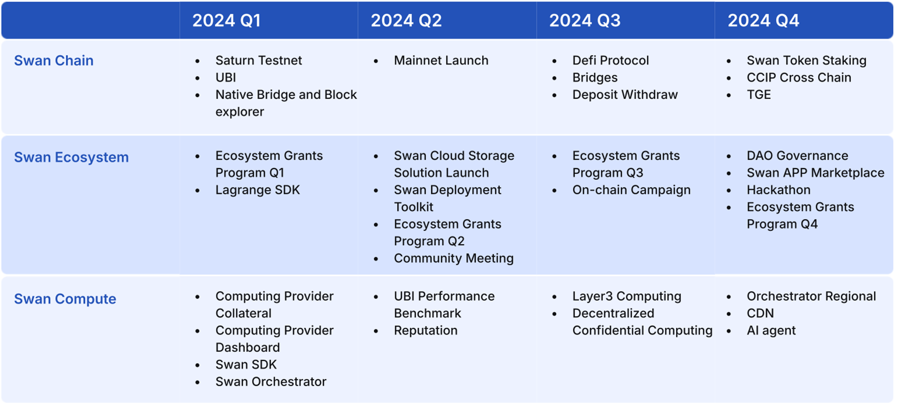

# Introduction to Swan Chain

[Swan Chain](https://www.swanchain.io) (formerly FilSwan), initiated in 2021, is a full toolset AI blockchain infrastructure designed to accelerate AI adoption. Utilizing OP superchain technology, [Swan Chain](https://www.swanchain.io/) merges Web3 with AI, offering comprehensive solutions across storage, computing, bandwidth, and payments. Through [Lagrange](https://lagrange.computer/), it enables efficient AI model deployment while reducing computing costs by up to 70% and monetizing idle computing resources.

SwanChain's innovative approach introduces a [Universal Basic Income (UBI) ](token/swan-universal-basic-income-ubi/)model for Computing Providers within its ZK market, ensuring stable income and incentivizing continuous contributions.

#### Core Objectives and Motivation

* **Decentralized AI Computing Market**: At the heart of Swan Chain's ambition is the creation of a marketplace that empowers AI developers with the necessary computational resources for training and deploying sophisticated AI models on AI platforms like [Lagrange](https://lagrange.computer/). This initiative is designed to fill the void between the high demand for premium computing in AI research and the resources available within the blockchain ecosystem.
* **Support for Web3 Projects**: Swan Chain acknowledges the transformative essence of Web3 technologies, aspiring to lay down a foundational infrastructure that underpins the deployment and functioning of decentralized applications (DApps). This includes a suite of decentralized storage solutions, computing power, and ancillary services, all aimed at propelling the decentralized web's expansion.
* **Innovative Ecosystem Products**: The ecosystem of Swan Chain is augmented with groundbreaking products like[ MultiChain.storage](https://www.multichain.storage) for decentralized data storage, the [Lagrange](https://lagrange.computer/) platform for decentralized computing, and a Decentralized Task Orchestrator, which collectively streamline the management and distribution of computing tasks across the network.
* **Universal Basic Income (UBI) Model**: A standout feature of Swan Chain is its commitment to fostering a fair and equitable ecosystem via the implementation of a UBI model for computing providers. This innovative approach guarantees compensation for participants' contributions, promoting inclusivity and sustainability within the network.

#### Enhanced Technologies and Infrastructure

Swan Chain incorporates state-of-the-art technologies to materialize its ambitious objectives:

* **Kubernetes and Blockchain Integration**: Utilizing Kubernetes for container orchestration alongside blockchain for securing transactions and automating processes, Swan Chain establishes a highly efficient, scalable, and secure infrastructure for decentralized computing.
* **Global Data Center Connectivity**: By orchestrating data centers globally, Swan Chain accesses an expansive pool of computational resources, ensuring utmost availability and redundancy for its services.
* **Zero-Knowledge (ZK) Proofs**: Emphasizing security and privacy, Swan Chain adopts ZK proofs for the benchmarking of computing providers and facilitating privacy-preserving transactions within its ecosystem.

#### Financial Innovations and ZK Market Development

Swan Chain significantly enhances AI computing payment systems through smart contract implementation, notably reducing fees for micro-payments as a Layer 2 solution and ensuring efficient computing task validation. Moreover, Swan Chain pioneers the development of a ZK computing market, bolstering the AI ecosystem with a robust framework for computing benchmarking and validation. This ZK market not only supports the AI computing demands but also underpins the UBI model by providing a sustainable income source for computing providers.

#### Vision and Future Outlook

Swan Chain is steadfast in its mission to redefine the development, deployment, and scaling of AI and Web3 projects. By offering accessible, secure, and high-performance computing resources, coupled with innovative payment solutions and a ZK computing market, Swan Chain addresses the extant challenges faced by developers and businesses. The platform's dedication to a sustainable and equitable ecosystem, highlighted by its UBI model, paves the way for how decentralized networks can prioritize community welfare and participation.

<figure><figcaption>
Layer1, Layer2,Layer3
</figcaption></figure>

#### Roadmap

<figure><figcaption></figcaption></figure>



## Protocol Stack

Cross Chain Computing Protocol

Swan Chain is designed as a full toolset AI Blockchain infrastructure, providing comprehensive solutions across storage, computing, bandwidth, and payments. The protocol stack is a multi-layered architecture that ensures efficient and secure operations within the Swan Chain ecosystem. Below is an overview of each layer in the protocol stack:

### Protocol Layers 

<figure><figcaption></figcaption></figure>

1. [Consensus Layer](https://docs.swanchain.io/core-concepts/protocol-stack/cross-chain-contracts)—responsible for smart contract execution and payment settlement.
2. [Peer-to-peer (P2P) Network](https://docs.swanchain.io/core-concepts/protocol-stack/peer-to-peer-p2p-network)—defines how nodes locate and connect.
3. [Payment Channels](https://docs.swanchain.io/core-concepts/protocol-stack/payment-channels) —facilitates fast and low-cost payments in the system.
4. [Service Discovery](https://docs.swanchain.io/core-concepts/protocol-stack/service-discovery) – Server nodes and reputation module for public service
5. [Market Provider](https://docs.swanchain.io/core-concepts/protocol-stack/market-provider) - Entity that offers various computing and storage tasks to the network
6. [Storage Layer](https://docs.swanchain.io/core-concepts/protocol-stack/storage-layer) — data stored on public blockchains or content addressable networks.
7. [Computing Layer ](https://docs.swanchain.io/core-concepts/protocol-stack/computing-layer)— how a query is routed to a specific node for computing.
8. [CDN Layer ](https://docs.swanchain.io/core-concepts/protocol-stack/cdn-layer)– how data is distributed and hosted on the global network
9. [Governance](https://docs.swanchain.io/core-concepts/protocol-stack/token/governance) —manages schemas, treasure, and disputes.

A Sample implication of Protocol

<figure><figcaption></figcaption></figure>
