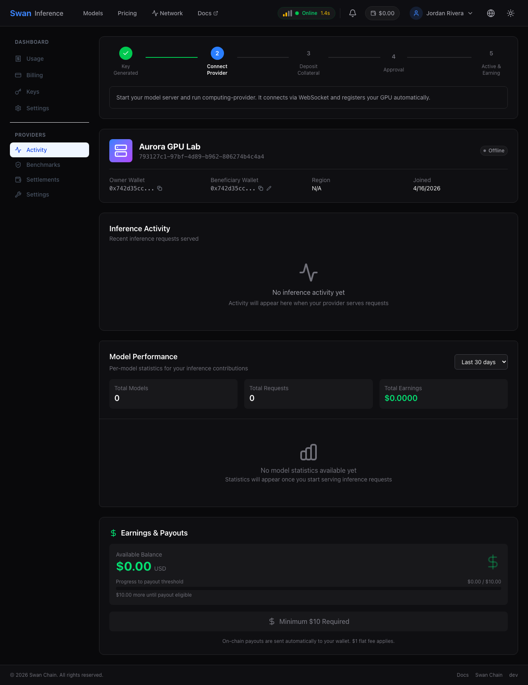
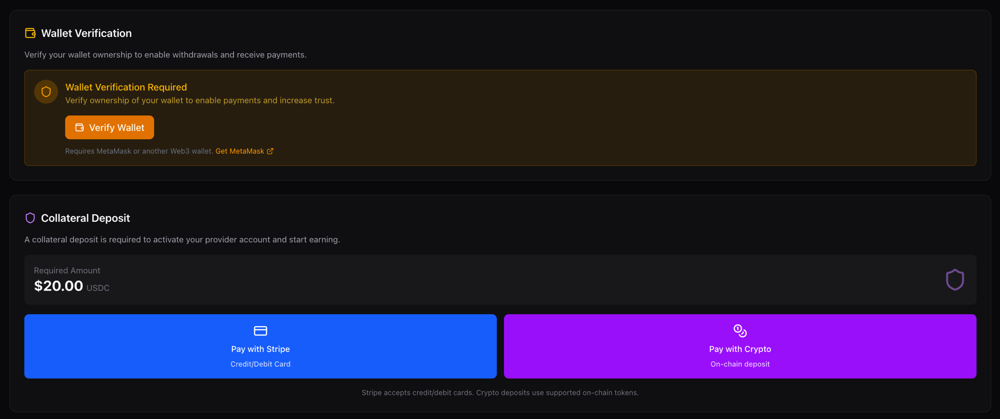
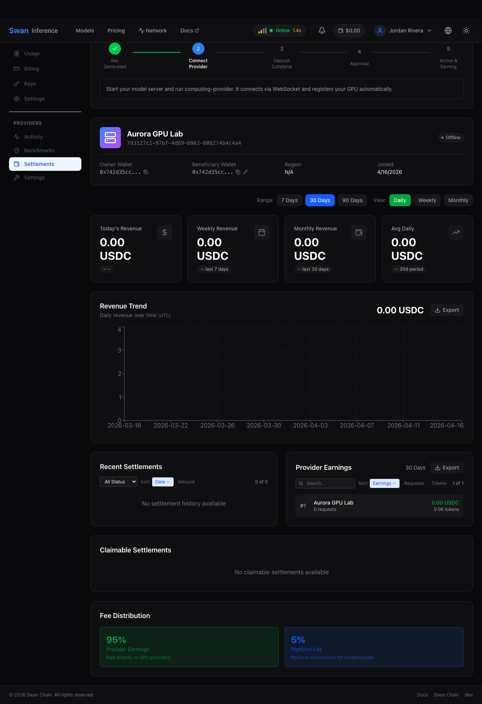

# Become a Provider

This guide walks through turning your GPU into an AI inference endpoint on Swan Chain — from starting a local model server, to installing the `computing-provider` agent, to earning stablecoin revenue from real inference traffic.


Looking to **consume** models instead of provide? See [How to Use Swan Inference](how-to-use.md).

For hardware tiers, collateral economics, revenue splits, and slashing rules, see the [Provider Onboarding](README.md#provider-onboarding) section of the Swan 2.0 overview. This page focuses on the hands-on setup.


## 0. Check prerequisites

Providers connect **outbound** to Swan Inference over WebSocket — **no public IP, domain, or SSL setup is required**. You just need a capable GPU and one of two supported OS/inference-engine stacks:

| Platform | Minimum hardware | Inference engine |
|----------|-----------------|-----------------|
| **Linux (NVIDIA)** | GPU with ≥ 8 GB VRAM (Tier C); 24 GB+ recommended (Tier A) | [SGLang](https://github.com/sgl-project/sglang) (recommended), vLLM, or Ollama |
| **macOS (Apple Silicon)** | M1/M2/M3/M4 with ≥ 16 GB unified memory | [Ollama](https://ollama.com) |

Legacy GPUs (TESLA P4, GTX 1050 Ti, anything < 8 GB VRAM) cannot serve modern inference workloads and will not receive traffic. Full tier-to-model mapping is in [Hardware Tiers](README.md#hardware-tiers).

You'll also need:

- **Go 1.22+** to build the `computing-provider` agent
- **Docker 24.0+ with the NVIDIA Container Toolkit** (Linux only)
- A funded wallet or credit card for collateral (step 5)

## 1. Start a model server

Your GPU needs an OpenAI-compatible inference server running locally. Swan Inference will route requests to it via the `computing-provider` agent.

### Linux (NVIDIA) — SGLang

```bash
# Download model weights from HuggingFace
computing-provider models download Qwen/Qwen2.5-7B-Instruct

# Start SGLang serving the model on port 30000
docker run -d --gpus all -p 30000:30000 --ipc=host --name sglang \
  -v ~/.swan/models/Qwen/Qwen2.5-7B-Instruct:/models \
  lmsysorg/sglang:latest \
  python3 -m sglang.launch_server --model-path /models \
    --host 0.0.0.0 --port 30000 \
    --served-model-name Qwen/Qwen2.5-7B-Instruct
```

Verify it's healthy: `curl http://localhost:30000/v1/models`.

### macOS (Apple Silicon) — Ollama

```bash
brew install ollama
ollama serve &
ollama pull qwen2.5:7b
```

Verify it's healthy: `curl http://localhost:11434/api/tags`.


The quickstart uses Qwen 2.5 7B as an example, but earnings scale with real token traffic. Browse the [model catalog](https://inference.swanchain.io/models) to find in-demand models with less provider competition.


## 2. Install the computing-provider agent

Clone and build from source (mainnet):

```bash
git clone https://github.com/swanchain/computing-provider.git
cd computing-provider
make clean && make mainnet && sudo make install

# Verify
computing-provider --version
```

Full install details including the NVIDIA Container Toolkit setup are in the [`computing-provider` README](https://github.com/swanchain/computing-provider#readme).

## 3. Run the setup wizard

The wizard creates your provider account (or logs you into an existing one), auto-discovers your running model server, and writes `config.toml` and `models.json`:

```bash
computing-provider setup
```

A typical run looks like this (macOS + Ollama):

```
============================================================
              Computing Provider Setup Wizard
============================================================


Step 1/5: Checking Prerequisites
------------------------------------------------------------
[ok] Ollama: ollama version is 0.14.1 (running)
[!] Docker: Docker not running. Please start Docker daemon. (optional - Ollama available)
[ok] GPU: Apple Silicon (Apple M1)

Step 2/5: Initializing Configuration
------------------------------------------------------------

Node Name [demo-provider]: demo-provider
Initialized CP repo at '/Users/swanchain/.swan/computing'.
[ok] Configuration initialized

Step 3/5: Authentication
------------------------------------------------------------

A Swan Inference account is needed to connect your provider to the network.
Do you already have a Swan Inference account [y/N]: n

Create a new Swan Inference account
Email: demo-provider@example.com
Password:

Creating account...
[ok] Account created!

Set up your provider profile
Provider Name [demo-provider]:

Wallet Address (optional, press Enter to skip):
-> Skipped - you can add a wallet later to start earning rewards

Registering your provider...
[ok] Provider registered!
-> Provider ID: 84bca13d-d056-4826-a1ca-ac4d43597a9c
-> Status: pending (your provider will be reviewed before it can earn rewards)

[!] SAVE THIS API KEY - it connects your machine to Swan Inference and is only shown once.

  API Key: sk-prov-535a****fb47

Step 4/5: Discovering Model Servers
------------------------------------------------------------
[ok] Found ollama at localhost:11434
  * qwen3:8b

Matching with Swan Inference models...
[ok]   qwen3:8b -> Qwen/Qwen3-8B (100%)

Step 5/5: Finalizing Setup
------------------------------------------------------------

Select models to enable:

  1) Qwen/Qwen3-8B - ollama @ http://localhost:11434  ~16GB  (local: qwen3:8b)
Enter selections (e.g., 1,3,4) or press Enter for all [all]:
[ok] Updated config.toml
[ok] Created models.json

============================================================
                      Setup Complete!
============================================================

What to do next:
  * Start your provider:  computing-provider run
  * Monitor in browser:   computing-provider dashboard
  * Check connection:     computing-provider inference status
```

**Save the `sk-prov-*` key** — it's shown once and authenticates this provider to the network.

If you already have a `sk-prov-*` key (for example, from the web signup at [inference.swanchain.io/provider-signup](https://inference.swanchain.io/provider-signup)), pass it directly:

```bash
computing-provider setup --api-key=sk-prov-xxxxxxxxxxxx
```

Config files land in `~/.swan/computing/`:

- `config.toml` — WebSocket URL, API key, node name
- `models.json` — mapping from Swan Inference model IDs to your local endpoints


Consumer keys (`sk-swan-*`) and provider keys (`sk-prov-*`) are different. The `computing-provider` agent only accepts `sk-prov-*` keys.


## 4. Start the provider and pass benchmarks

Run the agent:

```bash
nohup computing-provider run >> cp.log 2>&1 &
```

Then check your status:

```bash
computing-provider inference status
```

You'll move through these stages automatically:

```
Connect ──▶ Collateral ──▶ Approval ──▶ Active
(instant)   (see step 5)   (< 24 hrs)    (earning)
```

| Stage | What happens | Typical duration |
|-------|-------------|-----------------|
| **Connect** | Agent opens a WebSocket to Swan Inference, registers your models, and auto-runs math / code / latency benchmarks | Instant |
| **Collateral** | Deposit via Stripe or on-chain SWAN (step 5) | Instant |
| **Approval** | Admin reviews your benchmark results and collateral | < 24 hours |
| **Active** | Traffic starts flowing — you earn per-request revenue | Ongoing |

<figure><figcaption>The My Provider tab visualizes the activation flow: Start → Connect → Deposit Collateral → Approved → Active & Earning.</figcaption></figure>

## 5. Deposit collateral

Once approved, deposit collateral to unlock full traffic routing. Two options:

| Method | Currency | Processing | Refund |
|--------|----------|-----------|--------|
| **Stripe** | Credit/debit card (USD) | Instant | 7-day waiting period, back to original card |
| **On-chain** | SWAN tokens on Swan Mainnet | Requires SwanETH gas | 7-day waiting period, back to your wallet |

```bash
# Show instructions for your account (deposit address, minimum amount)
computing-provider inference deposit

# Verify deposit was seen on-chain
computing-provider inference deposit --check
```

<figure><figcaption>Provider dashboard's Collateral Deposit panel — verify your wallet, then pay the required amount via Stripe or on-chain crypto.</figcaption></figure>

Collateral amounts scale with hardware tier and earning multiplier. See [Computing Provider Collateral](../token/computing-provider-collateral/) for the full table.

## 6. Monitor earnings and uptime

The Provider dashboard at [inference.swanchain.io/dashboard](https://inference.swanchain.io/dashboard) shows live earnings, request counts, and benchmark history.

<figure><figcaption>Earnings dashboard with live request volume, per-model breakdown, and payout history.</figcaption></figure>

For a local view, the agent ships its own web dashboard:

```bash
computing-provider dashboard
# → http://localhost:3005
```

Set where payouts go:

```bash
computing-provider inference set-beneficiary 0xYourWalletAddress
```


**New Provider Grace Period:** For the first 7 days after activation, uptime and success-rate deprioritization are waived. Use this window to stabilize your setup before full routing weight kicks in.


## Switching or adding models

Edit `~/.swan/computing/models.json` — the agent watches this file and hot-reloads without restarting. Start additional model servers on different ports and add them all to the JSON. Full walkthrough with multi-GPU pinning is in the [`computing-provider` README](https://github.com/swanchain/computing-provider#switching-models).

## Troubleshooting

| Symptom | Fix |
|---------|-----|
| `invalid provider API key` | Verify key starts with `sk-prov-` and check `ApiKey` in `~/.swan/computing/config.toml` |
| `WebSocket connection failed` | Confirm outbound port 443 is open; URL must be `wss://` not `http://` |
| Provider online but no requests | Model name mismatch — `--served-model-name` must exactly match the key in `models.json` and a model ID in the [catalog](https://inference.swanchain.io/models) |
| `could not select device driver "nvidia"` | Install the NVIDIA Container Toolkit; see [`computing-provider` README](https://github.com/swanchain/computing-provider#install-nvidia-container-toolkit) |
| Stuck in `pending` | Provider needs collateral + passing benchmark + hardware check. Run `computing-provider inference status` to see which condition is missing |

Full troubleshooting catalog: [`computing-provider` README — FAQ](https://github.com/swanchain/computing-provider#faq).

## Next steps

- **[Provider Onboarding](README.md#provider-onboarding)** — hardware tiers, revenue split, slashing rules
- **[Computing Provider Income](../token/swan-provider-income.md)** — contribution score formula and reward distribution
- **[Computing Provider Collateral](../token/computing-provider-collateral/)** — required amounts and refund process
- **[Inference Marketplace](../market-provider/inference-marketplace.md)** — how pricing, routing, and settlement work under the hood

Questions? Reach the team on [Discord](https://discord.gg/swanchain) or open an issue on the [`computing-provider` repo](https://github.com/swanchain/computing-provider/issues).
