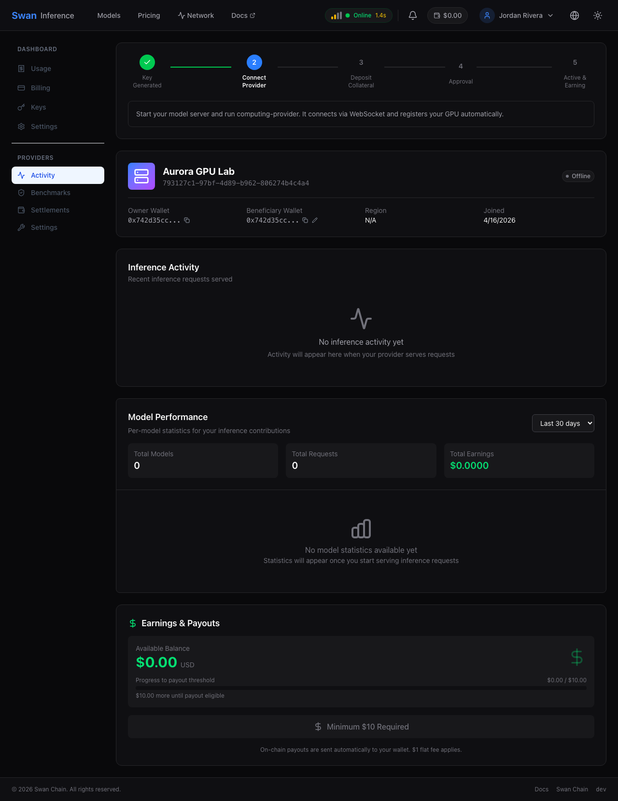
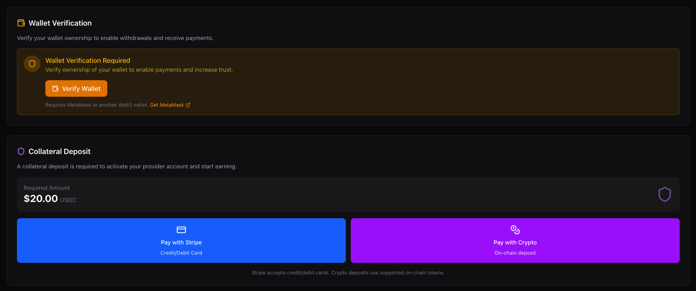
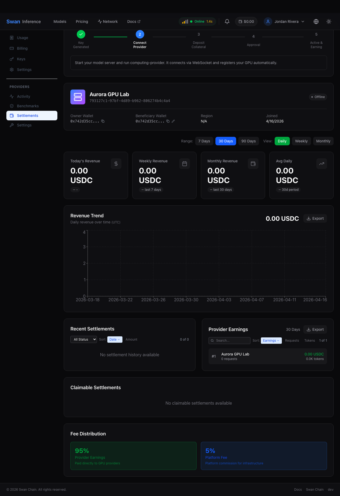

# Become a Provider

This guide walks through turning your GPU into an AI inference endpoint on Swan Chain — from starting a local model server, to installing the `computing-provider` agent, to earning stablecoin revenue from real inference traffic.


Looking to **consume** models instead of provide? See [How to Use Swan Inference](how-to-use.md).

For hardware tiers, collateral economics, revenue splits, and slashing rules, see the [Provider Onboarding](README.md#provider-onboarding) section of the Swan 2.0 overview. This page focuses on the hands-on setup.


## 0. Check prerequisites

Providers connect **outbound** to Swan Inference over WebSocket — **no public IP, domain, or SSL setup is required**. You just need a capable GPU and one of two supported OS/inference-engine stacks:

| Platform | Minimum hardware | Inference engine |
|----------|-----------------|-----------------|
| **Linux (NVIDIA)** | GPU with ≥ 8 GB VRAM (Tier C); 24 GB+ recommended (Tier A) | [SGLang](https://github.com/sgl-project/sglang) (recommended), vLLM, or Ollama |
| **macOS (Apple Silicon)** | M1/M2/M3/M4 with ≥ 16 GB unified memory | [Ollama](https://ollama.com) |

Legacy GPUs (TESLA P4, GTX 1050 Ti, anything < 8 GB VRAM) cannot serve modern inference workloads and will not receive traffic. Full tier-to-model mapping is in [Hardware Tiers](README.md#hardware-tiers).

You'll also need:

- **Go 1.22+** to build the `computing-provider` agent
- **Docker 24.0+ with the NVIDIA Container Toolkit** (Linux only)
- A funded wallet or credit card for collateral (step 5)

## 1. Start a model server

Your GPU needs an OpenAI-compatible inference server running locally. Swan Inference will route requests to it via the `computing-provider` agent.

### Linux (NVIDIA) — SGLang

```bash
# Download model weights from HuggingFace
computing-provider models download Qwen/Qwen2.5-7B-Instruct

# Start SGLang serving the model on port 30000
docker run -d --gpus all -p 30000:30000 --ipc=host --name sglang \
  -v ~/.swan/models/Qwen/Qwen2.5-7B-Instruct:/models \
  lmsysorg/sglang:latest \
  python3 -m sglang.launch_server --model-path /models \
    --host 0.0.0.0 --port 30000 \
    --served-model-name Qwen/Qwen2.5-7B-Instruct
```

Verify it's healthy: `curl http://localhost:30000/v1/models`.

### macOS (Apple Silicon) — Ollama

```bash
brew install ollama
ollama serve &
ollama pull qwen2.5:7b
```

Verify it's healthy: `curl http://localhost:11434/api/tags`.


The quickstart uses Qwen 2.5 7B as an example, but earnings scale with real token traffic. Browse the [model catalog](https://inference.swanchain.io/models) to find in-demand models with less provider competition.


## 2. Install the computing-provider agent

Clone and build from source (mainnet):

```bash
git clone https://github.com/swanchain/computing-provider.git
cd computing-provider
make clean && make mainnet && sudo make install

# Verify
computing-provider --version
```

Full install details including the NVIDIA Container Toolkit setup are in the [`computing-provider` README](https://github.com/swanchain/computing-provider#readme).

## 3. Run the setup wizard

The wizard creates your provider account (or logs you into an existing one), auto-discovers your running model server, and writes `config.toml` and `models.json`:

```bash
computing-provider setup
```

A typical run looks like this (macOS + Ollama):

```
============================================================
              Computing Provider Setup Wizard
============================================================


Step 1/5: Checking Prerequisites
------------------------------------------------------------
[ok] Ollama: ollama version is 0.14.1 (running)
[!] Docker: Docker not running. Please start Docker daemon. (optional - Ollama available)
[ok] GPU: Apple Silicon (Apple M1)

Step 2/5: Initializing Configuration
------------------------------------------------------------

Node Name [demo-provider]: demo-provider
Initialized CP repo at '/Users/swanchain/.swan/computing'.
[ok] Configuration initialized

Step 3/5: Authentication
------------------------------------------------------------

A Swan Inference account is needed to connect your provider to the network.
Do you already have a Swan Inference account [y/N]: n

Create a new Swan Inference account
Email: demo-provider@example.com
Password:

Creating account...
[ok] Account created!

Set up your provider profile
Provider Name [demo-provider]:

Wallet Address (optional, press Enter to skip):
-> Skipped - you can add a wallet later to start earning rewards

Registering your provider...
[ok] Provider registered!
-> Provider ID: 84bca13d-d056-4826-a1ca-ac4d43597a9c
-> Status: pending (your provider will be reviewed before it can earn rewards)

[!] SAVE THIS API KEY - it connects your machine to Swan Inference and is only shown once.

  API Key: sk-prov-535a****fb47

Step 4/5: Discovering Model Servers
------------------------------------------------------------
[ok] Found ollama at localhost:11434
  * qwen3:8b

Matching with Swan Inference models...
[ok]   qwen3:8b -> Qwen/Qwen3-8B (100%)

Step 5/5: Finalizing Setup
------------------------------------------------------------

Select models to enable:

  1) Qwen/Qwen3-8B - ollama @ http://localhost:11434  ~16GB  (local: qwen3:8b)
Enter selections (e.g., 1,3,4) or press Enter for all [all]:
[ok] Updated config.toml
[ok] Created models.json

============================================================
                      Setup Complete!
============================================================

What to do next:
  * Start your provider:  computing-provider run
  * Monitor in browser:   computing-provider dashboard
  * Check connection:     computing-provider inference status
```

**Save the `sk-prov-*` key** — it's shown once and authenticates this provider to the network.

If you already have a `sk-prov-*` key (for example, from the web signup at [inference.swanchain.io/provider-signup](https://inference.swanchain.io/provider-signup)), pass it directly:

```bash
computing-provider setup --api-key=sk-prov-xxxxxxxxxxxx
```

Config files land in `~/.swan/computing/`:

- `config.toml` — WebSocket URL, API key, node name
- `models.json` — mapping from Swan Inference model IDs to your local endpoints


Consumer keys (`sk-swan-*`) and provider keys (`sk-prov-*`) are different. The `computing-provider` agent only accepts `sk-prov-*` keys.


### Configuration reference

The wizard writes sensible defaults, but if it failed to discover your model server, you run a non-standard port, or you want to serve multiple models, edit these files directly.

**Provider config (`~/.swan/computing/config.toml`)**

```toml
# ~/.swan/computing/config.toml

[API]
Port = 8085
NodeName = "<YOUR_CP_Node_Name>"

[RPC]
SWAN_CHAIN_RPC = "https://mainnet-rpc01.swanchain.io"   # Swan Chain mainnet, chain ID 254

[Inference]
Enable = true
WebSocketURL = "wss://inference-ws.swanchain.io"          # production — do NOT use a dev/testnet endpoint
ApiKey = "sk-prov-YOUR_API_KEY"
Models = ["Qwen/Qwen2.5-7B-Instruct"]                    # must match keys in models.json and catalog IDs
```

**Model endpoints (`~/.swan/computing/models.json`)**

```json
{
  "Qwen/Qwen2.5-7B-Instruct": {
    "endpoint": "http://localhost:30000",
    "gpu_memory": 16000,
    "category": "text-generation"
  },
  "meta-llama/Llama-3.2-3B": {
    "endpoint": "http://localhost:11434",
    "gpu_memory": 14000,
    "category": "text-generation",
    "local_model": "llama3.2:3b",
    "context_length": 131072
  }
}
```

| Field | Required | Description |
|-------|----------|-------------|
| `endpoint` | Yes | URL of your local inference server (SGLang, vLLM, Ollama) |
| `gpu_memory` | Yes | GPU VRAM used by this model in MB |
| `category` | Yes | Model type: `text-generation`, `image`, `embedding`, `audio` |
| `local_model` | No | Local model name if different from the key (e.g., Ollama's `qwen2.5:7b`) |
| `api_key` | No | API key if your model server requires authentication |
| `context_length` | Recommended | The context window your backend **really** serves. Auto-detected from `max_model_len` on vLLM/SGLang only; set it explicitly for Ollama, llama.cpp or any proxy — see the [Context-Window Integrity notice](provider-context-window-faq.md) |
| `format`, `quantization` | No | Weight format (`fp16`, `awq`, `gptq`, `gguf`) and quantization detail (`q4_k_m`, `w4a16`, …), shown to consumers on the model page |

The keys in `models.json` must match valid Swan Inference model IDs **exactly**, including the organisation prefix (`meta-llama/Llama-3.2-3B`, not `llama-3.2-3b`). Run `computing-provider models catalog` or check the [model catalog](https://inference.swanchain.io/models) for the full list.

The agent watches `models.json` and hot-reloads on change — no restart needed. You can also force a reload:

```bash
curl -X POST http://localhost:8085/api/v1/computing/inference/models/reload
```

## 4. Start the provider and pass benchmarks

Run the agent:

```bash
nohup computing-provider run >> cp.log 2>&1 &
```

Then check your status:

```bash
computing-provider inference status
```

You'll move through these stages automatically:

```
Connect ──▶ Deposit collateral ──▶ Active (24 h probation) ──▶ Active
(instant)   (step 5)                (auto, once benchmark + GPU + collateral pass)
```

| Stage | What happens | Typical duration |
|-------|-------------|-----------------|
| **Connect** | The agent opens a WebSocket to Swan Inference, registers your models, and the registration benchmark (math, code, latency) runs | Minutes |
| **Collateral** | Deposit on-chain or by card (step 5) | Minutes to confirm |
| **Activation** | Automatic once collateral is confirmed, your GPU passes eligibility (≥ 8 GB VRAM, compute capability 8.0+) and the benchmark has passed. No admin approval is required; `computing-provider inference request-approval` exists as a parallel path if you want a human to look | Immediate after the three checks |
| **Probation** | The first 24 hours as `active`. Keep at least 50% uptime; otherwise the provider returns to `pending` and must re-benchmark | 24 hours |

<figure><figcaption>The My Provider tab visualizes the activation flow: Start → Connect → Deposit Collateral → Approved → Active & Earning.</figcaption></figure>

## 5. Deposit collateral

Collateral is a refundable deposit that backs the slashing rules; activation waits for it. Deposit on-chain from your owner wallet, or pay by card:

| Chain | Chain ID | Token | Minimum | Collateral contract |
|-------|----------|-------|---------|--------------------|
| Ethereum | 1 | USDC | 20 USDC | `0x1dEe92Da8fc4878795418aEde112100A57286a9a` |
| Base | 8453 | USDC | 20 USDC | `0x7fac98B02f4Fcda9Ac49508eb2E97E4BE4fecE9B` |
| Swan Chain | 254 | SWAN | 35,000 SWAN | `0x7fac98B02f4Fcda9Ac49508eb2E97E4BE4fecE9B` |
| Card (Stripe) | — | USD | shown at checkout | — |

```bash
# Show instructions for your account (deposit address, minimum amount)
computing-provider inference deposit

# Verify deposit was seen on-chain
computing-provider inference deposit --check
```

<figure><figcaption>Provider dashboard's Collateral Deposit panel — verify your wallet, then pay the required amount via Stripe or on-chain crypto.</figcaption></figure>

Refunds have a 7-day waiting period and suspend routing until complete. Details, lifecycle and slashing rules: [Earnings and Collateral](../token/computing-provider-collateral/README.md).

## 6. Monitor earnings and uptime

The Provider dashboard at [inference.swanchain.io/dashboard](https://inference.swanchain.io/dashboard) shows live earnings, request counts, and benchmark history.

<figure><figcaption>Earnings dashboard with live request volume, per-model breakdown, and payout history.</figcaption></figure>

For a local view, the agent ships its own web dashboard:

```bash
computing-provider dashboard
# → http://localhost:3005
```

Set where payouts go:

```bash
computing-provider inference set-beneficiary 0xYourWalletAddress
```


**New Provider Grace Period:** For the first 7 days after activation, uptime and success-rate deprioritization are waived. Use this window to stabilize your setup before full routing weight kicks in.


### What you earn, and how you get paid

* Each request credits you `tokens × payout price` for that model. Payout prices are shown in the dashboard's model market and in the public catalog; at the time of writing they are 90% of the consumer price for almost every model. See [Computing Provider Income](../token/swan-provider-income.md).
* Token Plan traffic is paid at the same rate but pro-rated against the plan pool at month end.
* Request a payout to your beneficiary wallet from **Payments**: minimum $10, flat $1 fee, one request per chain per hour. Set the wallet with `computing-provider inference set-beneficiary 0x…`, or convert earnings into inference credit instead.

### Provider status values

| Status | Can connect | Earning | Meaning |
|--------|-------------|---------|---------|
| `pending` | yes | no | Awaiting collateral, GPU eligibility or benchmark |
| `under_review` | yes | no | You requested manual review |
| `approved` | yes | no | Admin approved, awaiting collateral |
| `activating` | yes | no | Collateral verified, activation in progress |
| `active` | yes | **yes** | Serving and earning; shown as "Active (Probation)" for the first 24 h |
| `suspended` | no | no | Suspended by admin, or during a collateral refund |
| `rejected` | no | no | Application rejected |
| `offline` | no | no | Connection lost |

`computing-provider inference status` prints your status, the step you are on, and the next action.

### Staying verified

After activation the platform keeps checking that you serve what you registered: periodic benchmarks (results expire after 30 days), fingerprint challenges against your weight files, fixed-seed and logprob comparisons, and context-window probes. Results move a trust score that weights how much traffic you receive; repeated failures trip a circuit breaker until you recover, and verified misrepresentation can be slashed from collateral with a 48-hour appeal. `computing-provider selfcheck` catches the quiet failures — a model advertised but not served, a context window larger than the backend really accepts, a backend rejecting requests — before they cost you traffic.

## Switching or adding models

Edit `~/.swan/computing/models.json` — the agent watches this file and hot-reloads without restarting. Start additional model servers on different ports and add them all to the JSON. Full walkthrough with multi-GPU pinning is in the [`computing-provider` README](https://github.com/swanchain/computing-provider#switching-models).

## Troubleshooting

| Symptom | Fix |
|---------|-----|
| `invalid provider API key` | Verify key starts with `sk-prov-` and check `ApiKey` in `~/.swan/computing/config.toml` |
| `WebSocket connection failed` | Confirm outbound port 443 is open; URL must be `wss://` not `http://` |
| Provider online but no requests | Model name mismatch — `--served-model-name` must exactly match the key in `models.json` and a model ID in the [catalog](https://inference.swanchain.io/models) |
| `could not select device driver "nvidia"` | Install the NVIDIA Container Toolkit; see [`computing-provider` README](https://github.com/swanchain/computing-provider#install-nvidia-container-toolkit-linux-only) |
| Stuck in `pending` | Provider needs collateral + passing benchmark + hardware check. Run `computing-provider inference status` to see which condition is missing |

Full troubleshooting catalog: [`computing-provider` README — FAQ](https://github.com/swanchain/computing-provider#faq).

## Next steps

The [`computing-provider` repository](https://github.com/swanchain/computing-provider) carries the full [configuration reference](https://github.com/swanchain/computing-provider/blob/main/docs/configuration.md), [troubleshooting guide](https://github.com/swanchain/computing-provider/blob/main/docs/troubleshooting.md), [SGLang deployment](https://github.com/swanchain/computing-provider/blob/main/docs/sglang-deployment.md) and [tuning](https://github.com/swanchain/computing-provider/blob/main/docs/sglang-best-practices.md) notes, and [Apple Silicon support](https://github.com/swanchain/computing-provider/blob/main/docs/apple-silicon-support.md).

- **[Provider Onboarding](README.md#provider-onboarding)** — hardware tiers, revenue split, slashing rules
- **[Computing Provider Income](../token/swan-provider-income.md)** — contribution score formula and reward distribution
- **[Computing Provider Collateral](../token/computing-provider-collateral/)** — required amounts and refund process
- **[Inference Marketplace](../market-provider/inference-marketplace.md)** — how pricing, routing, and settlement work under the hood

Questions? Reach the team on [Discord](https://discord.gg/swanchain) or open an issue on the [`computing-provider` repo](https://github.com/swanchain/computing-provider/issues).
