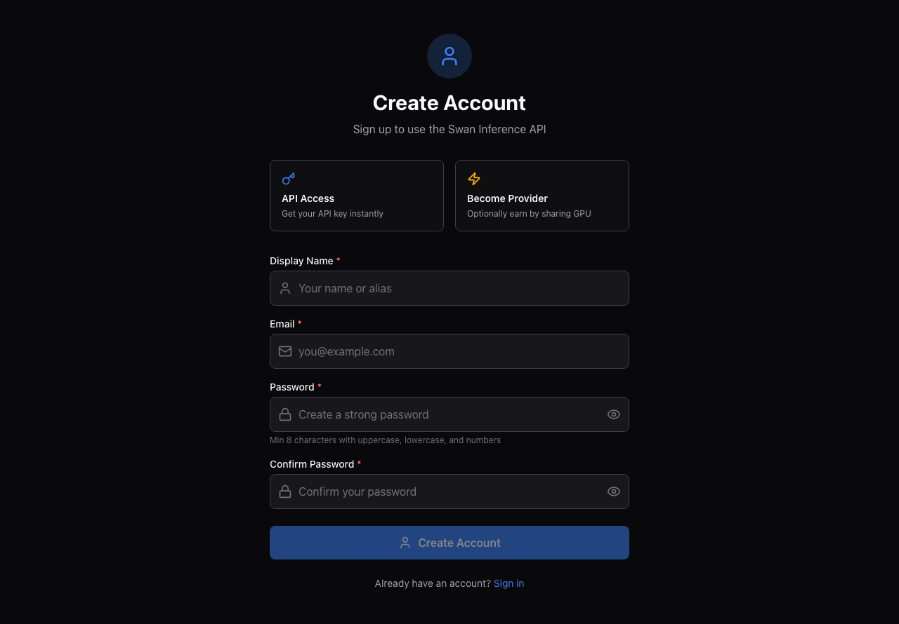
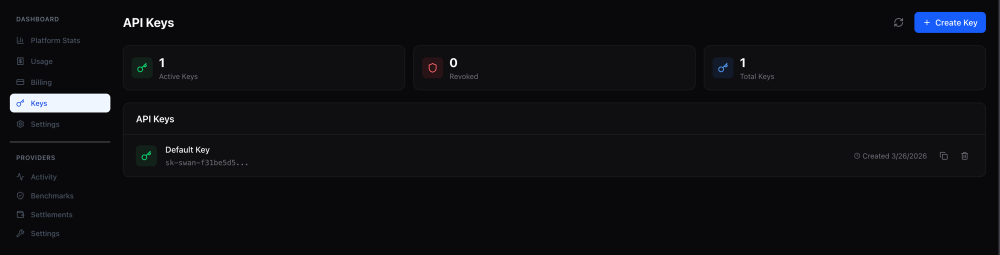
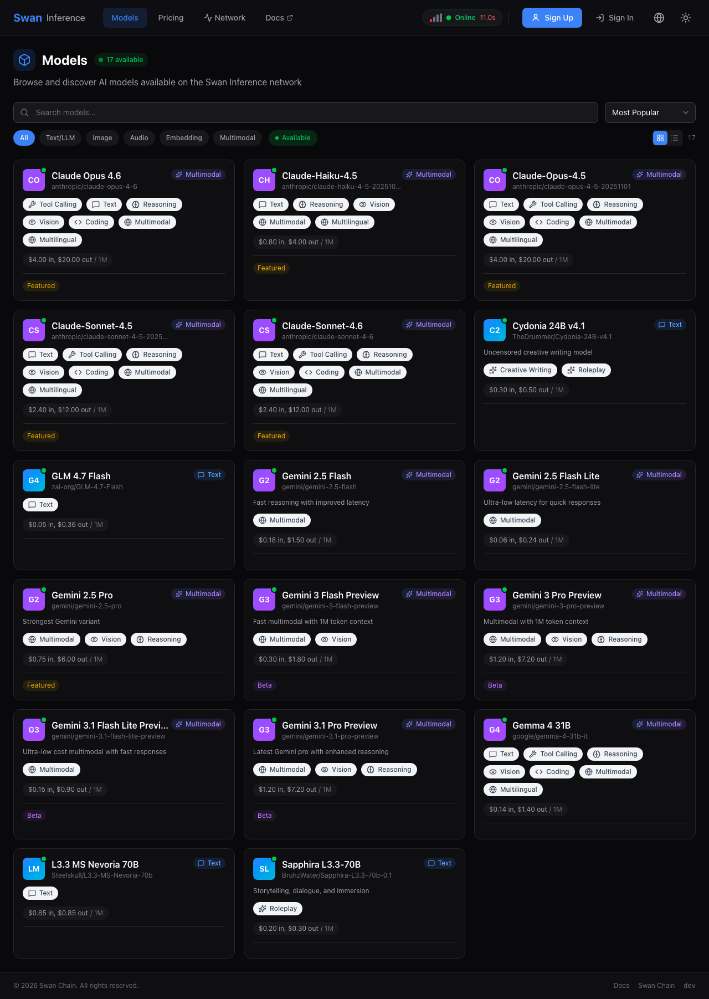
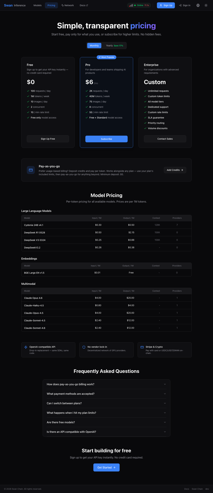
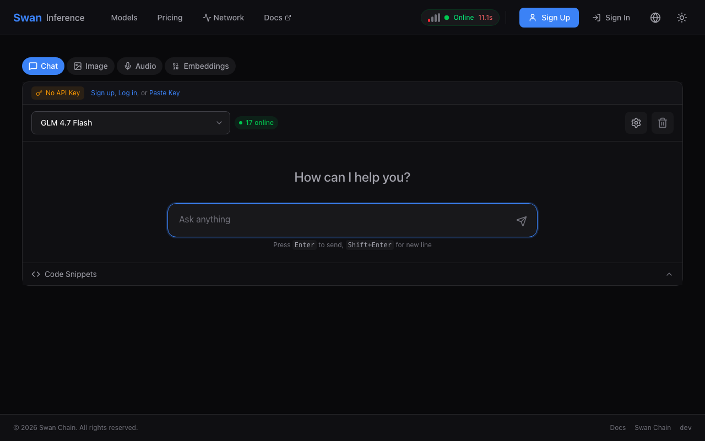
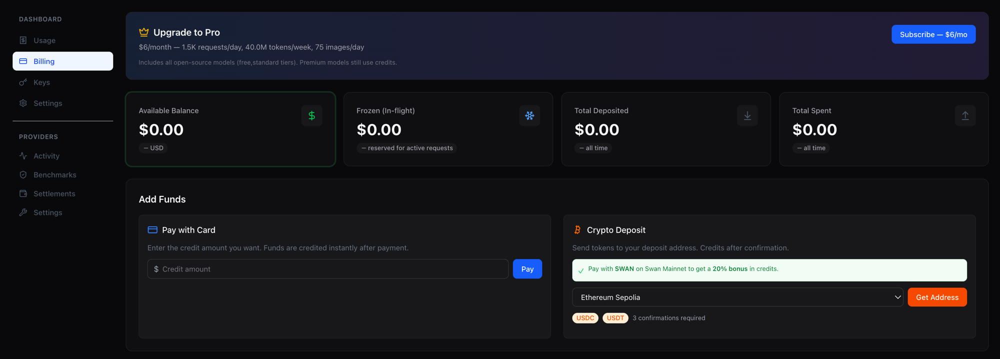
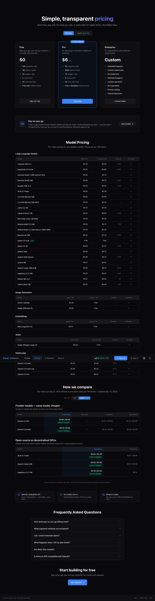

# How to Use Swan Inference

This guide walks through using Swan Inference as a developer consuming AI models — from signing up to making your first request and paying with SWAN for a 20% discount.


Looking to earn by providing GPU resources instead? See the provider onboarding section in [Swan 2.0: Inference Cloud](README.md#provider-onboarding).


## 1. Sign up and get your API key

Create a free account at [inference.swanchain.io/signup](https://inference.swanchain.io/signup) — email and password only, no credit card required to start.

<figure><figcaption>Sign up with email and password — API key is issued on first login.</figcaption></figure>

After signing up you'll land on the dashboard, where your API key (`sk-swan-*`) is shown. Keep it secret — it's the equivalent of a password.

<figure><figcaption>Your API key appears in the dashboard under "API Keys".</figcaption></figure>

## 2. Make your first inference request

Swan Inference is fully OpenAI-compatible, so any existing OpenAI SDK or integration works by changing two things: the base URL and the API key.

### curl

```bash
curl https://inference.swanchain.io/v1/chat/completions \
  -H "Authorization: Bearer sk-swan-YOUR-KEY" \
  -H "Content-Type: application/json" \
  -d '{
    "model": "anthropic/claude-haiku-4-5-20251001",
    "messages": [{"role": "user", "content": "Say hello in 5 words."}]
  }'
```

### OpenAI Python SDK

```python
from openai import OpenAI

client = OpenAI(
    base_url="https://inference.swanchain.io/v1",
    api_key="sk-swan-YOUR-KEY",
)

response = client.chat.completions.create(
    model="anthropic/claude-haiku-4-5-20251001",
    messages=[{"role": "user", "content": "Say hello in 5 words."}],
)
print(response.choices[0].message.content)
```

### OpenAI Node.js SDK

```javascript
import OpenAI from "openai";

const client = new OpenAI({
  baseURL: "https://inference.swanchain.io/v1",
  apiKey: "sk-swan-YOUR-KEY",
});

const response = await client.chat.completions.create({
  model: "anthropic/claude-haiku-4-5-20251001",
  messages: [{ role: "user", content: "Say hello in 5 words." }],
});
console.log(response.choices[0].message.content);
```

Streaming, embeddings, image generation, and audio transcription all work identically to OpenAI. See [OpenAI-Compatible API](README.md#openai-compatible-api) for the full endpoint list.

## 3. Browse models and compare pricing

The [Models page](https://inference.swanchain.io/models) lists every available model with live pricing, context length, and provider count.

<figure><figcaption>Live models catalog. Click any model for details and code examples.</figcaption></figure>

The [Pricing page](https://inference.swanchain.io/pricing) includes a side-by-side comparison against Anthropic, Google, OpenRouter, and other inference providers for hero models — so you can see at a glance how SwanChain's pricing stacks up.

<figure><figcaption>Pricing page with competitor comparison. Toggle USD / SWAN to see the stacked discount.</figcaption></figure>

## 4. Try models in the playground

No code required — the [Playground](https://inference.swanchain.io/playground) lets you test any model directly in the browser. Useful for prompt iteration before wiring up the API.

<figure><figcaption>Playground — pick a model, type a prompt, see the response and token usage.</figcaption></figure>

## 5. Top up credits

The free tier covers 50,000 daily tokens on Tier B models. For production use, top up your account balance via Stripe (credit card) or crypto deposit (USDC / USDT / SWAN on multiple EVM chains).

- **Stripe:** instant processing, minimum deposit $5
- **Crypto:** per-user HD-derived deposit address shared across EVM chains, minimum $1

<figure><figcaption>Deposit credits — Stripe or crypto, same balance.</figcaption></figure>

Usage is deducted from your balance in real time per inference request. View your balance, usage, and ledger under **Billing** in the dashboard.

## 6. Pay with SWAN for 20% off

Once your account has a SWAN token balance (via crypto deposit), you can pay for inference with SWAN and receive a **20% discount** on every request. The discount stacks on top of Swan's already-lower base prices — turning our 20–40% gateway discount into roughly 50–66% below going direct to Anthropic or Google.

<figure><figcaption>Flip the Pay-with toggle to SWAN and prices drop 20% across every model.</figcaption></figure>

To pay with SWAN in an API request, include the payment preference in the request header:

```bash
curl https://inference.swanchain.io/v1/chat/completions \
  -H "Authorization: Bearer sk-swan-YOUR-KEY" \
  -H "X-Swan-Payment: SWAN" \
  -H "Content-Type: application/json" \
  -d '{
    "model": "anthropic/claude-haiku-4-5-20251001",
    "messages": [{"role": "user", "content": "Hello!"}]
  }'
```

Balance deduction happens in SWAN, and the provider receives 95% of the revenue in their preferred payout currency.

## Next steps

- **[Inference Marketplace](../market-provider/inference-marketplace.md)** — deeper on how pricing, routing, and settlement work
- **[Provider onboarding](README.md#provider-onboarding)** — want to earn by sharing GPU resources instead?
- **[API reference](https://inference.swanchain.io/docs)** — full list of endpoints, parameters, and error codes

Questions? Reach the team on [Discord](https://discord.gg/swanchain) or open an issue on [GitHub](https://github.com/swanchain).
