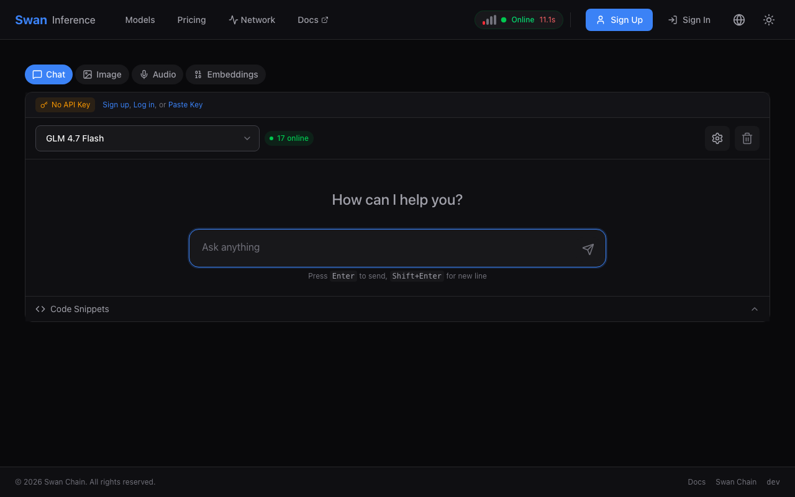
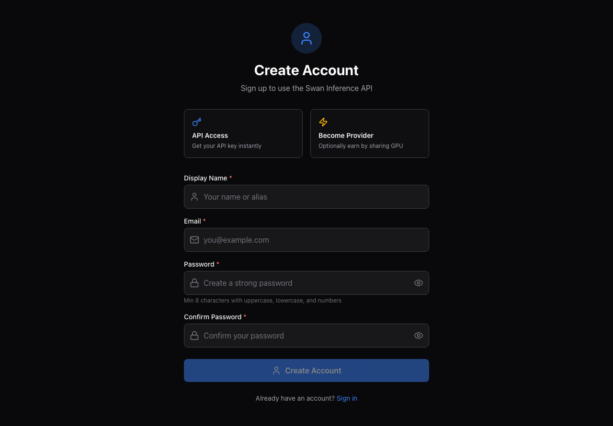
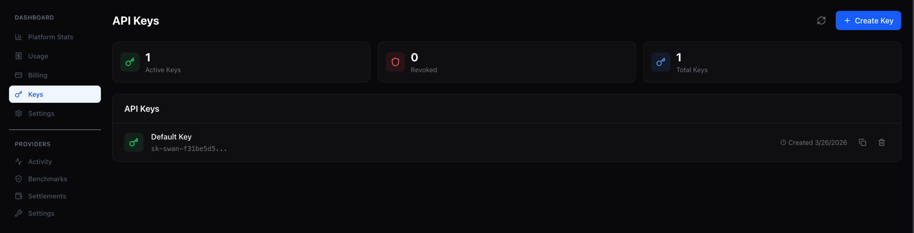
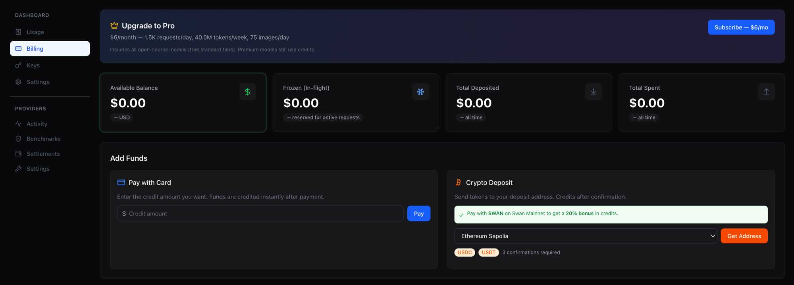
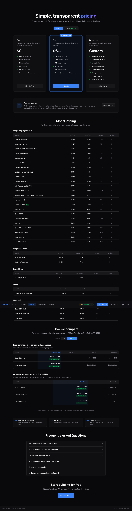
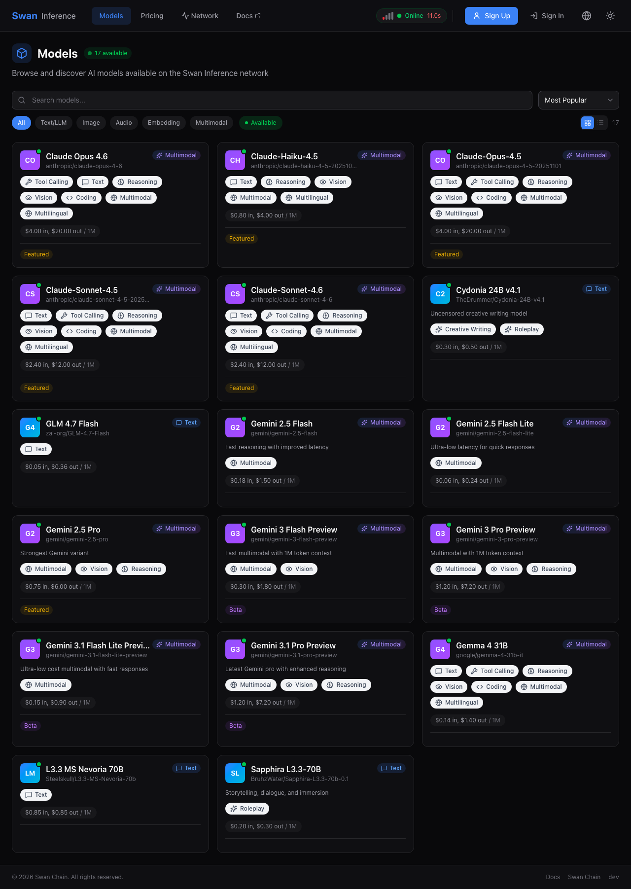
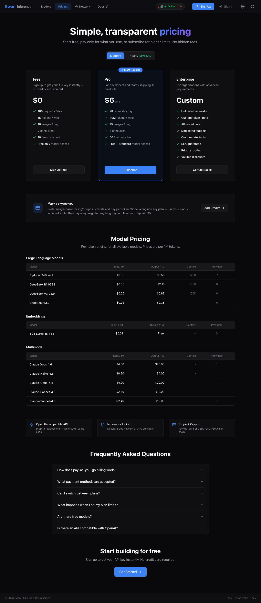

# How to Use Swan Inference

This guide walks through using Swan Inference as a developer consuming AI models — starting with a no-signup trial, then creating an account, topping up, and making real API requests.


Looking to earn by providing GPU resources instead? See [Become a Provider](become-a-provider.md) for the step-by-step setup guide.


## 0. Try it now — no signup

The fastest way to see Swan Inference in action: open the [playground](https://inference.swanchain.io/playground), pick a model, and send a message. No account, no API key, no credit card.

<figure><figcaption>Playground — runs GLM 4.7 Flash for anonymous visitors, rate-limited per IP.</figcaption></figure>

Ready for more? Sign up below to get an API key and start integrating.

## 1. Sign up and get your API key

Create a free account at [inference.swanchain.io/signup](https://inference.swanchain.io/signup) — email and password only, no credit card required.

<figure><figcaption>Sign up with email and password.</figcaption></figure>

After signing up, navigate to **Keys** in the dashboard. Your API key (`sk-swan-*`) is generated automatically — copy it and keep it secret.

<figure><figcaption>Your API key appears under Keys in the dashboard.</figcaption></figure>

## 2. Top up credits

Inference requests are paid per token, deducted from your account balance in real time. Fund your account via Stripe (credit card) or crypto deposit (USDC / USDT / SWAN on multiple EVM chains).

- **Stripe:** instant processing, minimum deposit $5
- **Crypto:** per-user HD-derived deposit address shared across EVM chains, minimum $1

<figure><figcaption>Add funds via Stripe card payment or crypto deposit.</figcaption></figure>

### 20% bonus when depositing SWAN

Depositing SWAN tokens on Swan Mainnet credits your account with a **20% bonus on top of the USD value** — $100 of SWAN becomes $120 of credits. Your account balance is a single USD-denominated pool regardless of how it was funded, so there's nothing special to toggle at request time; you simply get more credits per dollar when you deposit SWAN.

Combined with Swan's already-lower per-token pricing, the deposit bonus pushes effective rates roughly 50–66% below going direct to Anthropic or Google for comparable models. Flip the **Pay with: SWAN** toggle on the [pricing page](https://inference.swanchain.io/pricing) to see the effective rate across every model.

<figure><figcaption>Flip the Pay-with toggle to SWAN to preview the effective rate after the 20% deposit bonus.</figcaption></figure>

Usage is deducted from your balance per request. View balance, usage, and the transaction ledger under **Billing** in the dashboard.

### Or subscribe to the Token Plan

If you mostly use open-source models, the **Pro plan** ($6/month, billed monthly by card) includes **40M tokens per week and 1,500 requests per day on standard-tier models**, plus 75 images/day. Premium-tier models (Claude, Gemini Pro, …) stay pay-as-you-go from your credit balance, as does anything beyond the allowance and any request where you [choose the provider yourself](#5-optional-choose-the-provider). Subscribe from the [pricing page](https://inference.swanchain.io/pricing); a model's tier is shown on its catalog page.

## 3. Browse models

The [Models page](https://inference.swanchain.io/models) lists every model with live pricing, context length, tier, and how many providers are online for it right now — a model is only callable while at least one provider is serving it. Click any model for details and code examples.

<figure><figcaption>Live models catalog.</figcaption></figure>

The [Pricing page](https://inference.swanchain.io/pricing) compares SwanChain's rates side-by-side against Anthropic, Google, OpenRouter, and other providers for hero models — so you can see how prices stack up at a glance.

<figure><figcaption>Pricing page with competitor comparison.</figcaption></figure>

## 4. Make your first inference request

Swan Inference is fully OpenAI-compatible — any existing OpenAI SDK or integration works by changing two things: the base URL and the API key. The examples below use `zai-org/GLM-4.7-Flash`, one of the cheapest hero models at $0.05 input / $0.36 output per 1M tokens.

### curl

```bash
curl https://inference.swanchain.io/v1/chat/completions \
  -H "Authorization: Bearer sk-swan-YOUR-KEY" \
  -H "Content-Type: application/json" \
  -d '{
    "model": "zai-org/GLM-4.7-Flash",
    "messages": [{"role": "user", "content": "Say hello in 5 words."}]
  }'
```

### OpenAI Python SDK

```python
from openai import OpenAI

client = OpenAI(
    base_url="https://inference.swanchain.io/v1",
    api_key="sk-swan-YOUR-KEY",
)

response = client.chat.completions.create(
    model="zai-org/GLM-4.7-Flash",
    messages=[{"role": "user", "content": "Say hello in 5 words."}],
)
print(response.choices[0].message.content)
```

### OpenAI Node.js SDK

```javascript
import OpenAI from "openai";

const client = new OpenAI({
  baseURL: "https://inference.swanchain.io/v1",
  apiKey: "sk-swan-YOUR-KEY",
});

const response = await client.chat.completions.create({
  model: "zai-org/GLM-4.7-Flash",
  messages: [{ role: "user", content: "Say hello in 5 words." }],
});
console.log(response.choices[0].message.content);
```

Streaming, embeddings, image generation, and audio transcription all work identically to OpenAI. See the [API reference](../../bulders/app-developer/swan-inference-api.md) for every endpoint, the response headers that tell you which provider served you, and the limits.

## 5. Optional: choose the provider

Every model page lists the providers currently serving it, with each one's price, context window, quantization, 30-day uptime and typical time-to-first-token. To send a request to a specific one, add `X-Swan-Provider: <provider-id>`; add `X-Swan-Allow-Fallbacks: false` if you would rather the request fail than be served by someone else. The response tells you who served it and how it was billed (`X-Swan-Route-Mode`, `X-Swan-Fallback-Reason`, `X-Swan-Billing-Type`).

Two things to know: choosing a provider is **always pay-as-you-go from your credit balance** — it is not covered by a Token Plan, so keep some credit on the account — and it stays pay-as-you-go even if your provider is offline and a fallback serves the request. Details in the [API reference](../../bulders/app-developer/swan-inference-api.md#choosing-a-provider).

## Next steps

- **[Inference Marketplace](../market-provider/inference-marketplace.md)** — deeper on how pricing, routing, and settlement work
- **[Become a Provider](become-a-provider.md)** — want to earn by sharing GPU resources instead?
- **[API reference](../../bulders/app-developer/swan-inference-api.md)** — full list of endpoints, headers, limits and error codes
- **[AI agent integrations](../../bulders/app-developer/claw-tools-integration.md)** — point OpenClaw, Nanobot and friends at Swan Inference

Questions? Reach the team on [Discord](https://discord.gg/swanchain) or open an issue on [GitHub](https://github.com/swanchain).
