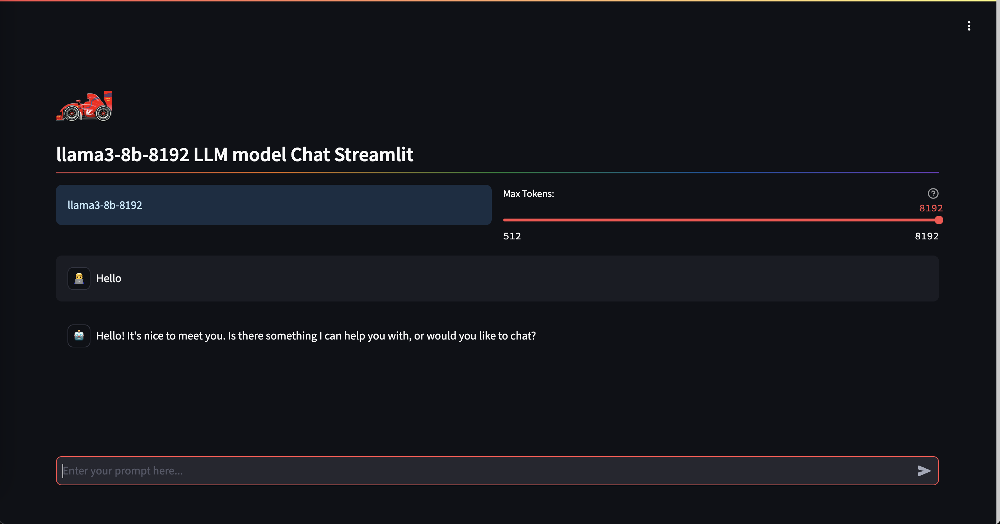

### 3. Deploy Deep Learning Container Images

In this tutorial, you will learn how to deploy a Llama3 application with just a few lines of code.

**Note** : [Click here to see the full demo code](https://github.com/swanchain/python-swan-sdk/blob/main/examples/ex2_modelapp.py)

**Prerequisites**:

Before starting, ensure you have completed the following tutorials:
* [Setting Up Your Swan Environment](../quick-start/setting-up-your-swan-environment.md)
* [Build a Basic Web Application](../quick-start/build-a-serverless-web-application.md)

#### 1. Log in to Orchestrator via SDK

(Same as the previous tutorial [Build a Basic Web Application](../quick-start/build-a-serverless-web-application.md))

```python
import swan
swan_orchestrator = swan.resource(api_key="<your_api_key>", network='mainnet', service_name='Orchestrator')
```

#### 2. Create a Task

A task is created through Swan Orchestrator to deploy the application on the distributed computing provider network.

**Notes**:
- **Optional**: Here, `hardware_id` is set to 13, which corresponds to GPU hardware type (NVIDIA 3080). To check the hardware ID for other hardware types, use:
  ```python
  available_hardware = swan_orchestrator.get_hardware_config()
  print(json.dumps(available_hardware, indent=2))
  ```
- The `auto_pay` parameter is set to `True`, meaning the SDK will automatically deduct SwanCreditToken from your wallet address. Ensure you have sufficient ETH for gas and SwanCreditToken in your wallet.
- [Bridge to get the gas](https://superbridge.app/swan-chain)
- [Faucet to get the SwanCreditToken](https://faucet.swanchain.io/)

```python
result = swan_orchestrator.create_task(
    repo_uri='https://github.com/swanchain/awesome-swanchain/tree/main/Llama3-8B-LLM-Chat',
    wallet_address='<WALLET_ADDRESS>',
    private_key='<PRIVATE_KEY>',
    hardware_id=13,
    duration=3600,
    auto_pay=True
)
task_uuid = result['id']
```

#### 3. Review the Deployment Result

After obtaining the task UUID, track the deployment result using the Orchestrator interface `get_deployment_info`:

```python
task_info = swan_orchestrator.get_deployment_info(task_uuid=task_uuid)
print(task_info)
```

<details>
<summary>Sample output (click to expand)</summary>

```json
{
  "data": {
    "computing_providers": [
      {
        "beneficiary": "0x000",
        "cp_account_address": "0x000",
        "created_at": 1722488518,
        "freeze_online": null,
        "id": 99,
        "lat": 35.8639,
        "lon": -78.535,
        "multi_address": [
          "/ip4/40.143.96.125/tcp/10011"
        ],
        "name": "new-cp-001",
        "node_id": "04d5b210591aa5aff5b4e49ad6a3ec57b72aefcdc99cd7888fff80b5991452d8a8dce099312cfb7e78637e04e9824a7274160e49176a00394745701ed450a113e2",
        "online": 1,
        "owner_address": "0x000",
        "region": "North Carolina-US",
        "task_types": "[1, 3]",
        "updated_at": 1722544641,
        "version": "2.0",
        "worker_address": "0x000"
      }
    ],
    "jobs": [
      {
        "build_log": "wss://log.cp.filezoo.com.cn:10011/api/v1/computing/lagrange/spaces/log?space_id=QmR7SP2ANxW55w9u6JuxvRs2wAD7asEibn9n6DKsykwR3U&type=build",
        "comments": "Running(downloadSource). downloadSource: no job_result_uri from api. downloadSource(Submitted).",
        "container_log": "wss://log.cp.filezoo.com.cn:10011/api/v1/computing/lagrange/spaces/log?space_id=QmR7SP2ANxW55w9u6JuxvRs2wAD7asEibn9n6DKsykwR3U&type=container",
        "cp_account_address": "0x000",
        "created_at": 1722544628,
        "duration": 3600,
        "ended_at": null,
        "hardware": "C1ae.small",
        "id": 5,
        "job_real_uri": "https://g7dlk8hii5.cp.filezoo.com.cn",
        "job_result_uri": null,
        "job_source_uri": "https://plutotest.acl.swanipfs.com/ipfs/QmR7SP2ANxW55w9u6JuxvRs2wAD7asEibn9n6DKsykwR3U",
        "name": "Job-cb9e9afc-f51c-4fb3-9f70-384e9342e516",
        "node_id": "04d5b210591aa5aff5b4e49ad6a3ec57b72aefcdc99cd7888fff80b5991452d8a8dce099312cfb7e78637e04e9824a7274160e49176a00394745701ed450a113e2",
        "start_at": 1722544628,
        "status": "Running",
        "storage_source": "swanhub",
        "task_uuid": "f6e81501-4d59-44fe-9ce9-85f8ccc86529",
        "type": null,
        "updated_at": 1722544659,
        "uuid": "cb9e9afc-f51c-4fb3-9f70-384e9342e516"
      }
    ],
    "task": {
      "comments": null,
      "created_at": 1722544608,
      "end_at": 1722548208,
      "id": 3,
      "leading_job_id": "cb9e9afc-f51c-4fb3-9f70-384e9342e516",
      "name": null,
      "refund_amount": null,
      "refund_wallet": "0x000",
      "source": "v2",
      "start_at": 1722544608,
      "start_in": 300,
      "status": "completed",
      "task_detail": {
        "amount": 0.0,
        "bidder_limit": 3,
        "created_at": 1722544608,
        "dcc_selected_cp_list": null,
        "duration": 172800,
        "end_at": 1722548208,
        "hardware": "<hardware_name>",
        "job_result_uri": null,
        "job_source_uri": "https://plutotest.acl.swanipfs.com/ipfs/QmR7SP2ANxW55w9u6JuxvRs2wAD7asEibn9n6DKsykwR3U",
        "price_per_hour": "0.0",
        "requirements": {
          "hardware": "None",
          "hardware_type": "GPU",
          "memory": "2",
          "preferred_cp_list": null,
          "region": "global",
          "storage": null,
          "update_max_lag": null,
          "vcpu": "2"
        },
        "space": {
          "activeOrder": {
            "config": {
              "description": "3080",
              "hardware": "GPU",
              "hardware_id": 0,
              "hardware_type": "GPU",
              "memory": 2,
              "name": "<hardware_name>",
              "price_per_hour": 10.0,
              "vcpu": 2
            }
          },
          "name": "0",
          "uuid": "1770b0a6-929f-4e50-aa53-2e1614459ae0"
        },
        "start_at": 1722544608,
        "status": "paid",
        "storage_source": "swanhub",
        "type": "None",
        "updated_at": 1722544608
      },
      "task_detail_cid": "https://plutotest.acl.swanipfs.com/ipfs/QmSoWh97T8xUKQMd6HEKhWiuHHeSjXgpY5yFpauW5v1Yo1",
      "tx_hash": null,
      "type": "None",
      "updated_at": 1722544632,
      "user_id": 4,
      "uuid": "f6e81501-4d59-44fe-9ce9-85f8ccc86529"
    }
  },
  "message": "fetch task info for task_uuid='f6e81501-4d59-44fe-9ce9-85f8ccc86529' successfully",
  "status": "success"
}
```

</details>

#### 4. Access the Deployed Application

Retrieve the deployed application's URL:

```python
result_url = swan_orchestrator.get_real_url(task_uuid)
print(result_url)
```

Sample output:

```
[https://jpz44b3hmq.computing.filezoo.com.cn]
```

Once the job status is `Running`, you can access the application via the URL in your web browser.

Sample screenshot:

<figure><figcaption></figcaption></figure>