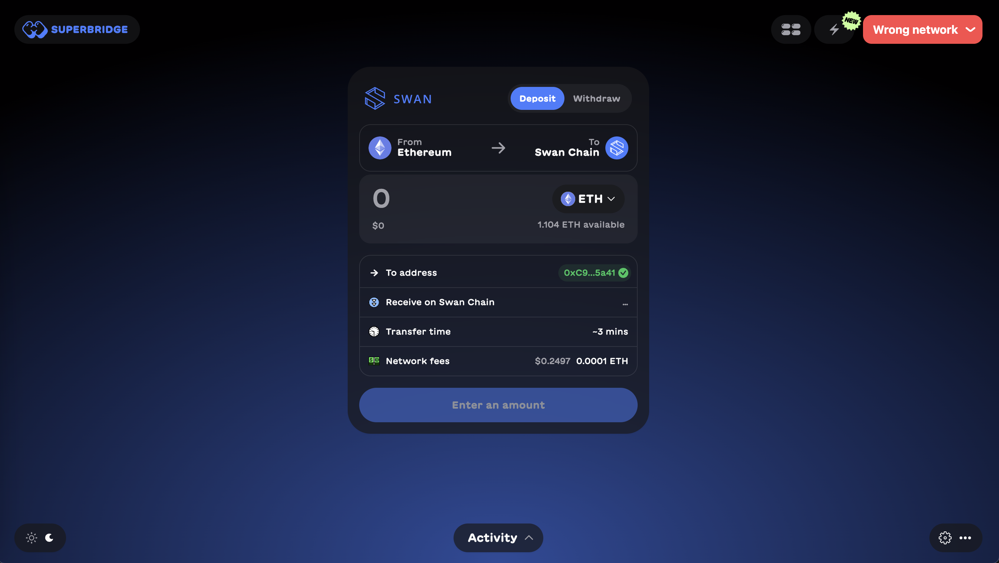
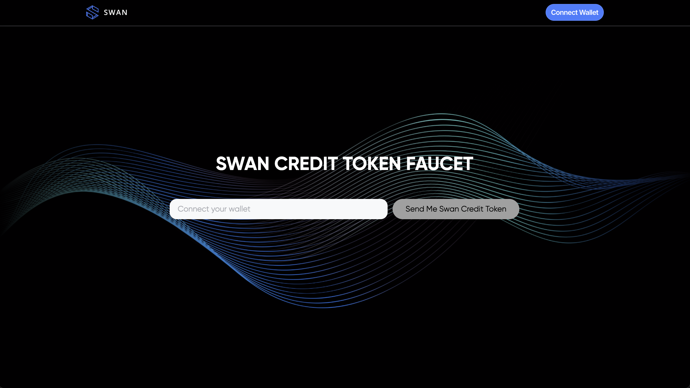
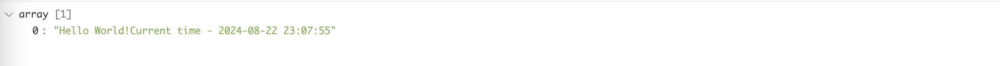

### 1. Setting Up Your Swan Environment

In this tutorial, you will set up your SWAN account and development environment, allowing you to interact with your SWAN account and the Orchestrator backend.

#### Steps:

* **Obtain an API Key**:
    * Open the [SWAN dashboard](https://orchestrator.swanchain.io/provider-status).
    * Connect your wallet using your preferred tool.
    * Retrieve your API Key:
        - After signing in, click on the profile icon and select "Show API Key".

            <figure><figcaption></figcaption></figure>

        - Click "New API Key" to generate a new key, which will appear in the list.

            <figure><figcaption></figcaption></figure>
        
        - Go to [Bridge](https://superbridge.app/swan-chain) to get gas and [Faucet](https://faucet.swanchain.io/) to get SwanCreditToken. 
            <figure><figcaption></figcaption></figure>
            <figure><figcaption></figcaption></figure>

#### Install Swan SDK

You can install the Swan SDK using one of the following methods:

- **Via PyPI (Recommended)**:
  ```bash
  pip install swan-sdk
  ```
- **From GitHub**:
  - Clone the repository:
    ```bash
    git clone https://github.com/swanchain/python-swan-sdk.git
    ```
  - Create and activate a virtual environment (optional):
    ```bash
    python3 -m venv venv
    source venv/bin/activate
    ```
  - Install the requirements:
    ```bash
    pip install -r requirements.txt
    ```
  - Install the SDK:
    ```bash
    pip install .
    ```
    or if you want to change the source code:
    ```bash
    pip install -e .
    ```

**Note**: Ensure that `web3.py` version 6.15 or later is installed to avoid potential errors. (```pip install web3>=6.15```)

#### Test Your Environment
You can test your environment by running the following code snippet:

```python
import swan
import json
swan_orchestrator = swan.resource(api_key="<your_api_key>", network='mainnet', service_name='Orchestrator')
result = swan_orchestrator.create_task(
    app_repo_image='hello_world', # This "app_repo_image" is a special name-repo mapping made by Swan, it's DEMO ONLY
    wallet_address='<WALLET_ADDRESS>',
    private_key='<PRIVATE_KEY>'
)
task_uuid = result['id']
task_info = swan_orchestrator.get_deployment_info(task_uuid=task_uuid)
print(json.dumps(task_info, indent=2))
```
if you see the deployment information like this, your environment is set up correctly:
```json

{
  "data":{
    "computing_providers":[
      ...
    ],
    "jobs":[
      ...
    ],
    "task":{
      ...
    },
    "space":{
      ...
    }
  },
  "message":"fetch task info for task_uuid='dfb9c94a-dcb1-4b92-a54b-046ea7d745cc' successfully",
  "status":"success"
}
```
### Check Status(Optional)
You can now run this code to check the status of your deployment.
- **Note**: You should copy the task uuid from the previous code response and comment out the previous code, otherwise, you will create a new deployment.
```python
result_url = swan_orchestrator.get_real_url(task_uuid)
print(result_url)
```
you can click the url to see the result, It will be something like this:
<figure><figcaption></figcaption></figure>