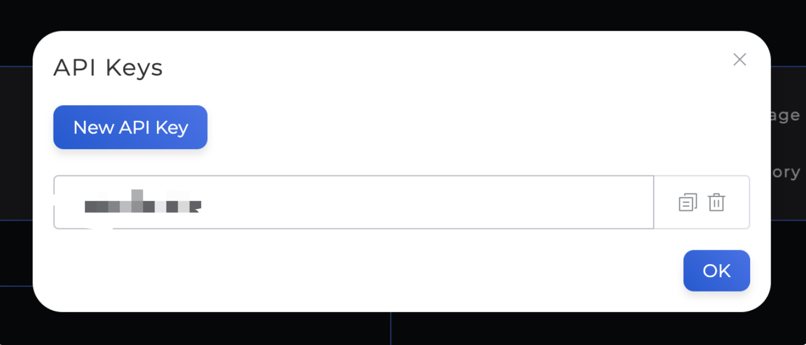

### 1. Setting Up Your Swan Environment

In this tutorial, you will set up your SWAN account and development environment, allowing you to interact with your SWAN account and the Orchestrator backend.

#### Steps:

* **Obtain an API Key**:
    * Open the [SWAN dashboard](https://orchestrator.swanchain.io/provider-status).
    * Connect your wallet using your preferred tool.
    * Retrieve your API Key:
        - After signing in, click on the profile icon and select "Show API Key".

        <figure><figcaption></figcaption></figure>

        - Click "New API Key" to generate a new key, which will appear in the list.

        <figure><figcaption></figcaption></figure>

#### Install Swan SDK

You can install the Swan SDK using one of the following methods:

- **Via PyPI**:
  ```bash
  pip install swan-sdk
  ```
- **From GitHub**:
  ```bash
  git clone https://github.com/swanchain/python-swan-sdk.git
  ```

**Note**: Ensure that `web3.py` version 6.15 or later is installed to avoid potential errors.