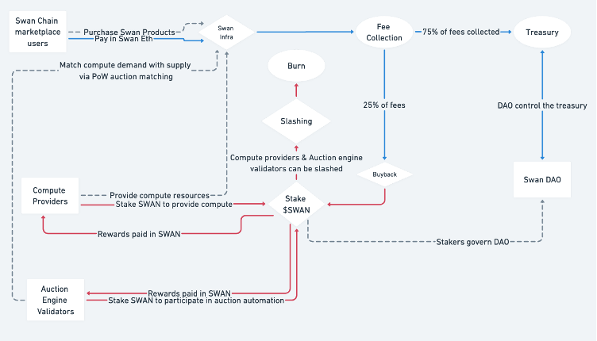

# Tokenomics

## Overview

SwanChain introduces a comprehensive tokenomics structure designed to support its ecosystem's growth, incentivize participation, and ensure operational sustainability. This document outlines the strategic allocation, governance mechanisms, planned token release schedule, and specific formulas for the Foundation Community Pool (FCP), Edge Computing Providers (ECP), and Market Providers (MP) to provide a clear understanding of how SwanChain utilizes its native tokens to drive network engagement and development.

### Total Token Supply

* **Total Supply:** 1,000,000,000 Swan Tokens

<figure><figcaption></figcaption></figure>

### Token Allocation and Distribution Breakdown

#### 1. Investors (20%)

* **Purpose:** To fund the initial development and expansion phases of SwanChain.
* **Details:** Investors provide essential capital for foundational buildout and scaling operations. This funding supports technical development, operational infrastructure, and initial market strategies.

#### 2. DAO Treasury (20%)

* **Purpose:** To manage investments, cover legal costs, and other financial necessities.
* **Details:** The DAO Treasury is critical for financial management and operational expenditures. It is funded by contributions from market providers and is used for strategic investments and covering essential expenses such as legal fees.

#### 3. Ecosystem Fund (25%)

* **Purpose:** To support ecosystem growth through grants, projects, and other initiatives.
* **Details:** This fund is crucial for nurturing innovation within the SwanChain ecosystem, providing financial support to developers, startups, and community projects that contribute to the network’s enhancement.

#### 4. Core Contributors (15%)

* **Purpose:** To reward and retain the developers and team members who are integral to the development and maintenance of SwanChain.
* **Details:** This allocation ensures that the developers and personnel central to SwanChain’s operations are motivated and retained, facilitating ongoing innovation and network maintenance.

#### 5. Airdrops (20%)

* **Purpose:** To incentivize broad network participation and engagement.
* **Details:** Airdrops distribute Swan tokens widely across the community to stimulate network activity and growth, enhancing user adoption and community vibrancy.

### Governance and Incentives

#### Governance Participation

* **Staking Requirement:** Community members must stake tokens to participate in governance decisions.
* **Governance Rewards:** Active participants may receive rewards, such as 1% of the DAO Treasury, to incentivize involvement and wise decision-making.

#### Annual Inflation and UBI

* **Annual Inflation Rate:** Ranges between 5% and 10%, determined by the governance team.
* **Universal Basic Income (UBI):** Tokens are distributed as UBI to eligible network participants, promoting sustained engagement and rewarding contributions.

### Collateral and Slashing Mechanism

#### Collateral Requirements

To ensure commitment and mitigate potential risks associated with fraudulent activities, all providers on the network must post collateral to participate. There are three types of providers:

**Fog Computing Provider (FCP)**

* **Role:** Offers a layered network extending cloud capabilities to the edge, providing services like AI model training and deployment.
* **Hardware Requirements:**
  * Public IP
  * Domain name (\*.example.com)
  * SSL certificate
  * At least 8 vCPUs
  * Minimum 100 GB SSD storage
  * 64 GB memory
  * 50 MB bandwidth
  * 2 GPUs (e.g., RTX 3080)
* **Collateral:** Required to stake a significant amount of tokens as collateral to ensure commitment and reliability.

**Edge Computing Provider (ECP)**

* **Role:** Focuses on processing data for near real-time applications at the network’s edge, such as IoT sensor data analysis and image recognition.
* **Hardware Requirements:**
  * Public IP
  * At least 4 vCPUs
  * 300 GB HDD storage
  * 32 GB memory
  * 20 MB bandwidth
  * 1 GPU (e.g., RTX 3080)
* **Collateral:** Required to stake a substantial amount of tokens as collateral to ensure service quality and prevent fraudulent activities.

**Market Provider (MP)**

* **Role:** Facilitates the allocation of computing jobs to providers using an auction engine for job distribution and a payment engine for financial transactions.
* **Collateral:** Required to stake a large amount of tokens as collateral. Market providers benefit from the ability to collect commission fees and receive 20% of the network incentives.

#### Slashing Mechanism

* **Fraud Detection:** If a provider’s computing job is proven fraudulent, the collateral is subject to a 2x slashing.
* **Token Burn:** The slashed tokens are sent to a burning address, effectively removing them from circulation and penalizing dishonest behavior.

### Token Flow Diagram

<figure><figcaption>
Token Flow Diagram
</figcaption></figure>

#### Explanation:

* **Purchase Swan Products:** Users purchase products and pay in Swan ETH.
* **Match Compute Demand:** Demand is matched with supply via Proof-of-Work auction matching.
* **Fee Collection:** 75% of fees collected go to the Treasury, and 25% of fees go to Buyback.
* **Slashing:** Compute providers and auction engine validators can be slashed.
* **Staking:** Providers stake $SWAN to provide compute and participate in auction automation.
* **Rewards:** Rewards are paid in SWAN tokens to compute providers and auction engine validators.
* **Treasury Management:** DAO controls the treasury and allocates funds accordingly.

### Formulas for Collateral and Reward Calculation

#### Fog Computing Provider (FCP) Formula

* **Collateral Requirement (C\_FCP):**&#x20;

$$
C_{FCP} = 100 \times (vCPU + \frac{SSD_storage}{100} + \frac{memory}{10} + \frac{bandwidth}{10} + GPU)
$$

* &#x20;Where:
  * vCPU: Number of virtual CPUs
  * SSD\_storage: SSD storage in GB
  * memory: Memory in GB
  * bandwidth: Bandwidth in MB/s
  * GPU: Number of GPUs

#### Edge Computing Provider (ECP) Formula

* **Collateral Requirement (C\_ECP):**&#x20;

$$
C_{ECP} = 50 \times (vCPU + \frac{HDD_storage}{100} + \frac{memory}{10} + \frac{bandwidth}{10} + GPU)
$$

&#x20;Where:

* vCPU: Number of virtual CPUs
* HDD\_storage: HDD storage in GB
* memory: Memory in GB
* bandwidth: Bandwidth in MB/s
* GPU: Number of GPUs

#### Market Provider (MP) Formula

* **Collateral Requirement (C\_MP):**&#x20;

$$
C_{MP} = 200 \times (\text{Base Collateral} + \frac{\text{Transaction Volume}}{1000})
$$

Where:

* Base Collateral: A fixed minimum collateral required
* Transaction Volume: Total transaction volume handled by the Market Provider

### UBI Distribution Example

To illustrate how SwanChain's Universal Basic Income (UBI) system works with a 5% annual inflation rate and a governance-determined allocation, we will provide examples using the given parameters:

#### Parameters:

* **Annual Inflation Rate:** 5%
* **Circulating Supply for the First Year:** 50,000,000 Swan Tokens
* **UBI Allocation:**
  * 40% to Edge Computing Providers (ECP)
  * 40% to Fog Computing Providers (FCP)
  * 20% to Market Providers (MP)

#### Providers:

* **Number of ECPs:** 400
* **Number of FCPs:** 100
* **Number of MPs:** 3

#### Step-by-Step Calculation:

1. **Calculate the total annual UBI allocation:**

$$\text{Total Annual UBI} = \text{Circulating Supply} \times \text{Annual Inflation Rate}$$&#x20;

$$
\text{Total Annual UBI} = 50,000,000 \times 0.05 = 2,500,000 \text{ Swan Tokens}
$$

1.  **Determine the allocation for each provider category:**

    * **ECP Allocation:**&#x20;

    $$\text{ECP Allocation} = \text{Total Annual UBI} \times 0.40 = 2,500,000 \times 0.40 = 1,000,000 \text{ Swan Tokens}$$

* **FCP Allocation:** $$\text{FCP Allocation} = \text{Total Annual UBI} \times 0.40 = 2,500,000 \times 0.40 = 1,000,000 \text{ Swan Tokens}$$
* **MP Allocation:** $$\text{MP Allocation} = \text{Total Annual UBI} \times 0.20 = 2,500,000 \times 0.20 = 500,000 \text{ Swan Tokens}$$

1. **Calculate the UBI per provider in each category:**
   * **UBI per ECP:** $$\text{UBI per ECP} = \frac{\text{ECP Allocation}}{\text{Number of ECPs}} = \frac{1,000,000}{400} = 2,500 \text{ Swan Tokens per ECP}$$
   * **UBI per FCP:** $$\text{UBI per FCP} = \frac{\text{FCP Allocation}}{\text{Number of FCPs}} = \frac{1,000,000}{100} = 10,000 \text{ Swan Tokens per FCP}$$
   * **UBI per MP:** $$\text{UBI per MP} = \frac{\text{MP Allocation}}{\text{Number of MPs}} = \frac{500,000}{3} \approx 166,666.67 \text{ Swan Tokens per MP}$$
2. **Calculate the monthly UBI per provider:**
   * **Monthly UBI per ECP:** $$\text{Monthly UBI per ECP} = \frac{\text{UBI per ECP}}{12} = \frac{2,500}{12} \approx 208.33 \text{ Swan Tokens}$$
   * **Monthly UBI per FCP:** $$\text{Monthly UBI per FCP} = \frac{\text{UBI per FCP}}{12} = \frac{10,000}{12} \approx 833.33 \text{ Swan Tokens}$$
   * **Monthly UBI per MP:** $$\text{Monthly UBI per MP} = \frac{\text{UBI per MP}}{12} = \frac{166,666.67}{12} \approx 13,888.89 \text{ Swan Tokens}$$

## Swan Token Value Flow

The Swan token has 2 stages:

1. [Swan Testnet](token.md#swan-testnet-token)
2. [Swan Mainnet](token.md#swan-mainet-token)

#### Swan Testnet

Swan Testnet Token (Swan) is used on Swan Testnet. The Swan Testnet is designed to Launch in Q4 2023.

#### Swan Mainnet

Swan is a L2 blockchain on Ethereum with Rollup technology.

