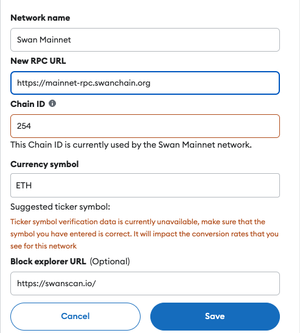

# Network Information

## Network Information

<table><thead><tr><th width="282"></th><th></th></tr></thead><tbody><tr><td><strong>Network Name</strong></td><td>Swan Chain</td></tr><tr><td><strong>Chain ID</strong></td><td>254</td></tr><tr><td><strong>Currency Symbol</strong></td><td>ETH</td></tr><tr><td><strong>Block Explorer URL</strong></td><td><a href="https://swanscan.io/">https://swanscan.io</a> （If it fails,try <a href="https://mainnet-explorer.swanchain.io/">https://mainnet-explorer.swanchain.io</a>)</td></tr></tbody></table>

<table><thead><tr><th width="767">RPC List</th></tr></thead><tbody><tr><td><a href="https://mainnet-rpc.swanchain.org">https://mainnet-rpc.swanchain.org</a></td></tr><tr><td><a href="https://mainnet-rpc-01.swanchain.org">https://mainnet-rpc-01.swanchain.org</a></td></tr><tr><td><a href="https://mainnet-rpc-02.swanchain.org">https://mainnet-rpc-02.swanchain.org</a></td></tr><tr><td><a href="https://mainnet-rpc-02.swanchain.org">https://mainnet-rpc-03.swanchain.org</a></td></tr><tr><td><a href="https://mainnet-rpc-02.swanchain.org">https://mainnet-rpc-04.swanchain.org</a></td></tr><tr><td><a href="https://mainnet-rpc01.swanchain.io">https://mainnet-rpc01.swanchain.io</a></td></tr></tbody></table>


**Important:** If you experience any issues with any of these RPCs, please switch to another one immediately.


## Set Up Metamask

### **Step 1: Add Swan Chain to Metamask**

1. Open MetaMask and click on the network selector at the top left.
2. Select "Add network" and then "Add a network manually."
3. Fill in the details for Swan Chain Mainnet:

* Network Name: Swan Chain Mainnet
* New RPC URL:[ https://mainnet-rpc.swanchain.org](https://mainnet-rpc.swanchain.org)
* Chain ID: 254
* Currency Symbol: ETH
* Block Explorer URL: [https://swanscan.io](https://swanscan.io/)

<figure><figcaption></figcaption></figure>

4. Click "Save" or "Add" to save the network.

### **Step 2: Import Tokens**

1. In Metamask, click on "Import tokens" at the bottom of the Tokens tab.
2. Enter the token contract address for SWAN Credit Token:

`0xAF90ac6428775E1Be06BAFA932c2d80119a7bd02`

3. The token symbols and decimals should autofill. If not, check the block explorer.
4. Click "Import" to confirm.
