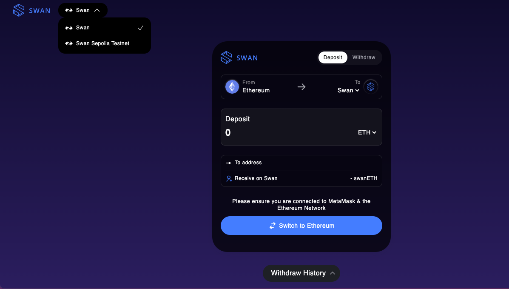

# Multi-Chain Storage

[Multi-Chain Storage](https://docs.filswan.com/multichain.storage/overview), or MCS, developed by the Swan Network, is a new kind of storage service that works with different blockchain networks. It transcends traditional cloud storage by using smart contracts for enhanced security, reminiscent of an [S3 storage gateway](https://aws.amazon.com/storagegateway/file/s3/) but with the added benefit of decentralization.


_Learn more about MCS in_[ _its documentation_](https://docs.filswan.com/multichain.storage/overview)_._


<figure><figcaption></figcaption></figure>

### Why Choose Multi-Chain Storage? 

Multi-Chain Storage offers several advantages over traditional cloud services, such as:

* **Decentralization:** MCS eliminates the need for intermediaries and third-party providers, giving users full control and ownership over their data. MCS also prevents censorship and tampering by ensuring that files are replicated and verified across multiple nodes.
* **Interoperability:** MCS supports multiple blockchains, including Ethereum, Polygon and more. This means that users can access their files from any chain they prefer, without being locked into a single platform or network.
* **Cost-efficiency:** MCS reduces the cost of storage by utilizing the spare capacity of existing nodes. MCS also optimizes the storage allocation and distribution based on the demand and supply of each chain.
* **Scalability:** MCS can handle large volumes of data and traffic without compromising speed or quality. MCS also adapts to the changing conditions of each chain, such as congestion, fees, and latency.

### What Can You Store with Multi-Chain Storage? 

Multi-Chain Storage can store any type of file that can be hosted on a website, such as:

* Images, videos, audio, and other media formats
* PDFs, documents, spreadsheets, and other office files
* JSON, XML, CSV, and other data formats
* HTML, CSS, JavaScript, and other web development languages
